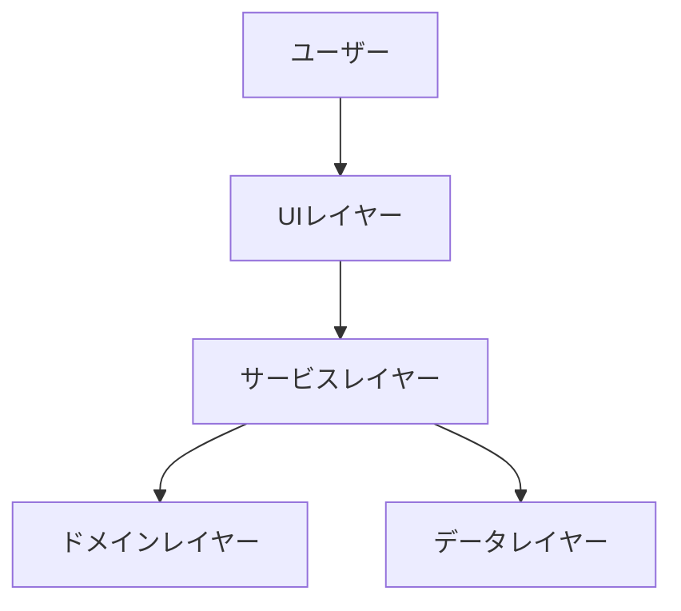
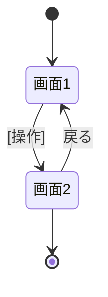
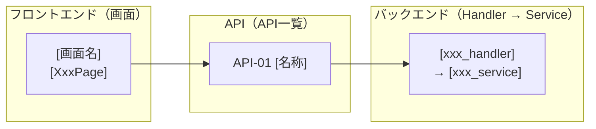

# 機能設計書 (Functional Design Document)

> 【正本テンプレート】このファイルは `docs/baseline/functional-design.md` に配置する。
> `baseline/` は**プロジェクトの指標**であり、記載漏れやあいまいな未確定事項を残してはいけない。
> 本ファイルには、一覧・カタログ・正本表・中核ロジック・確定した仕様決定など、**プロジェクトの
> 意思決定としてぶれてはいけない重要点**を集約する（システム構成図・技術スタック・データモデル・
> 中核アルゴリズム・API/画面/ユースケースの一覧・モジュール構成図）。
> JSON入出力例・レイヤー別インターフェース・シーケンス図のフル表記・UI表示仕様やテスト戦略の詳細など、
> **必要な時にだけ参照すればよい実装詳細**は `docs/specs/2_basic-design/` に分割する
> （分割の判断基準は `CLAUDE.md`「baseline と specs の使い分け」）。
> 技術選定の詳細な根拠は `docs/baseline/architecture.md` を参照。

## システム構成図



> レイヤーの方針を1〜数行で記述（依存の向き、純粋ロジックを置く層など）。詳細な責務・許可/禁止は
> `architecture.md`「アーキテクチャパターン」を正本とし、ここでは概要のみ。

## 技術スタック

| 分類 | 技術 | 選定理由 |
|------|------|----------|
| 言語 | [言語名] | [理由] |
| フレームワーク | [名称] | [理由] |
| データベース | [名称] | [理由] |
| ツール | [名称] | [理由] |

> 技術選定の詳細な根拠は `docs/baseline/architecture.md` を正本とする。

## データモデル

> 本節は**概念モデル**（エンティティ・区分値・ドメイン上の制約・ER図）までを扱う。カラム定義・型・
> NULL可否・デフォルト・物理制約名・索引名などの**物理スキーマ**は、論理設計より具体・実装寄りの
> 情報のため `docs/specs/3_detail-design/db/table-definition.md`（テーブル定義書）を正本とする。

### エンティティと区分値

- エンティティ: **[エンティティ1]** / **[エンティティ2]**。関係: [例: A 1 ―― * B]。
- コード・API・ドメインロジックで用いる区分値（型名と取りうる値）:
  - `[EnumType]` = `[値1]` | `[値2]` | ...

### ドメイン上の制約（物理スキーマで表現しないもの）

物理的な制約（型・NULL・一意・CHECK）は `docs/specs/3_detail-design/db/table-definition.md`
（テーブル定義書）を正本とする。以下は DB では担保せず、ドメイン層で扱う意味・ルールのみを記す。

- [DB制約ではなくアプリ/ドメイン層で担保する条件（→ 関連ロジックへリンク）]
- [ステータスや区分の意味・集計上の扱い]
- [論理削除などの方針とその理由]

### ER図

> エンティティ・属性は**日本語の論理名**で示す（物理名との対応は `table-definition.md` を参照）。

```mermaid
erDiagram
    エンティティ1 ||--o{ エンティティ2 : 持つ
    エンティティ1 {
        UUID [主キーの論理名] PK
        [型] [属性1の論理名]
        TIMESTAMPTZ 作成日時
    }
    エンティティ2 {
        UUID [主キーの論理名] PK
        UUID [外部キーの論理名] FK
        [型] [属性1の論理名]
    }
```

### 確定事項（概念レベル）

他ドキュメントが前提とする、ぶれてはいけない決定を短く列挙する（物理的な詳細は
`table-definition.md` へ）。

- [日付・時刻の基準（サーバーローカル／タイムゾーン等）]
- [削除方針（論理削除か物理削除か）]
- [一意性の単位（何と何の組で一意か）]
- [その他、他ドキュメントから参照される確定事項]

> **重要**: ここに「詳細設計で確定」のような曖昧な先送りを残さない。未確定事項があれば、
> この場でユーザーと一緒に確定させてから書く。物理スキーマ（カラム定義・制約・索引）の詳細作成は
> 本ガイドの範囲外。baseline のデータモデルが確定したら、**`specs-detail-design` スキル**を使って
> `docs/specs/3_detail-design/db/table-definition.md` を作成する。

## アルゴリズム設計（ドメインロジック）

> **本アプリの中核ロジック**であり、テスト設計の主対象。純粋関数として（外部依存なしに）設計する。
> 該当しないプロジェクトでは本節を省略してよい。

### アルゴリズム: [アルゴリズム名]

**目的**: [何を算出/判定するか]

**計算ロジック**:
- [ステップ1の説明、計算式]
- [ステップ2の説明、計算式]

**計算式（まとめ）**:
```
[結果] = [式]
```

**エッジケース（テスト対象）**:
- [境界条件1]
- [境界条件2]

**例**:
```
入力: [例]
出力: [結果]
```

> アルゴリズムごとに上記ブロックを繰り返す。実装場所（例: `backend: internal/domain/xxx`）を明記する。

## API一覧

> API契約の正本がある場合（例: `openapi.yaml`）はそれを正本とし、本節は **ID・名前・メソッド・
> パスのカタログ**のみを管理する。各APIの入出力詳細・JSON例・エラーレスポンスは
> `docs/specs/2_basic-design/api-design.md` へ。

| ID | API名 | メソッド | パス | 概要 |
|---|---|---|---|---|
| API-01 | [API名] | GET | `/[resource]` | [概要] |

> API名・ID の採番は本一覧を正本とし、追加時は連番で付与する。

## 画面設計（該当する場合）

### 画面一覧

> ルートはフロントエンドのパスであり、API パス（「API一覧」）とは別物。**本節の画面一覧を画面命名の
> 正本**とする。「主なAPI」列を画面→API 対応の正本とし、俯瞰図は「モジュール構成図」を参照。

| 画面名 | ルート(FE) | 対応コンポーネント | 目的 | 主な要素 | 主なAPI |
|---|---|---|---|---|---|
| [画面名] | `[/path]` | `[XxxPage]` | [目的] | [主な要素] | [呼ぶAPI] |

> 表示コンポーネントの責務は `docs/specs/2_basic-design/component-design.md` を参照。

### 画面遷移図



> ノード名は画面一覧の対応コンポーネント（例: `Dashboard`＝`DashboardPage`）に対応させる。

## ユースケース一覧

> 主要ユースケースを一覧化する。各ユースケースのシーケンス図（レイヤー横断の詳細な挙動）は
> `docs/specs/2_basic-design/usecase.md` へ。

| ID | ユースケース | アクター | 目的 | 関連画面 |
|---|---|---|---|---|
| UC-01 | [ユースケース名] | [アクター] | [目的] | [関連画面] |

## モジュール構成図（画面 × API × バックエンド）

フロントエンドの画面と backend のモジュールを **API で紐づける俯瞰図**。対応データの正本は各節に置く:
画面一覧＝「画面設計」、API一覧＝「API一覧」、各モジュールの責務＝
`docs/specs/2_basic-design/component-design.md` の各層セクション。



**読み方**:
- 画面 → API: 各画面が呼ぶ API（詳細は「画面設計」の「主なAPI」列が正本）。
- API 定義: メソッド・パス・入出力は「API一覧」が正本（ノードは同じ ID）。
- API → backend モジュール: 責務・依存は `component-design.md` の各層、物理配置は
  [リポジトリ構造定義書](repository-structure.md)。

> API を追加・変更したら「API一覧」を更新し、本図も追随させる。
