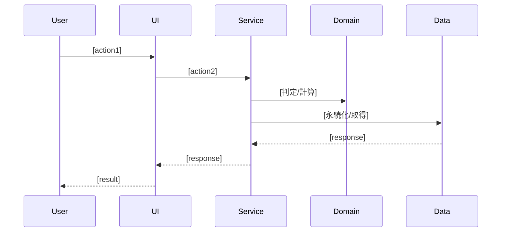

# ユースケース図（シーケンス詳細）

> 【分割テンプレート】このファイルは `docs/specs/2_basic-design/usecase.md` に配置する。
> ユースケース一覧（ID・アクター・目的・関連画面）の正本は `docs/baseline/functional-design.md`
> 「ユースケース一覧」。本ファイルは各ユースケースのレイヤー横断シーケンス（システム挙動）の
> **詳細**（必要な時にだけ参照すればよい実装レベルの記述）のみを置く。
> 画面一覧・画面遷移は baseline の「画面設計」、各層の責務は
> `docs/specs/2_basic-design/component-design.md`、集計/判定アルゴリズムは
> baseline の「アルゴリズム設計（ドメインロジック）」を参照。

## ユースケース: [ユースケース名]（UC-01）

**フロー説明**:
1. [ステップ1]
2. [ステップ2]

> 主要ユースケースごとに、baseline の一覧の ID（UC-01, UC-02, …）に対応させて上記シーケンスを
> 繰り返す。集計・判定ロジックの詳細は baseline の「アルゴリズム設計（ドメインロジック）」へリンクする。
