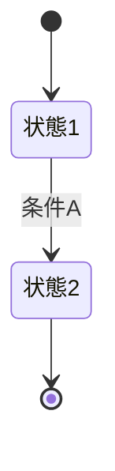

# プロジェクト用語集 (Glossary)

## 概要

このドキュメントは、プロジェクト内で使用される用語の定義を管理します。

**更新日**: [YYYY-MM-DD]

> **記法の原則**: 各カテゴリは**テーブル形式**で一覧化する（1用語=1行）。
> 定義項目が繰り返し構造になるものは見出し羅列にせず、テーブルにまとめて一覧性を優先する。
> セル内で改行・箇条書きが必要な場合は `<br>` と `・` を使う。
> 図・状態遷移図・複数行のコード例などテーブルに収まらないものだけ、テーブル直下に補足として置く。

## ドメイン用語

プロジェクト固有のビジネス概念や機能に関する用語。

| 用語（英語表記） | 定義 | 説明・補足 | 関連用語 |
|---|---|---|---|
| [用語1]<br>([English]) | [1〜2文での簡潔な定義] | [詳細な説明・制約・使用例（`<br>` で改行可）] | [関連用語 / 関連用語] |
| [用語2]<br>([English]) | [定義] | [説明] | [関連用語] |

## 技術用語

プロジェクトで使用している技術・フレームワーク・ツールに関する用語。

| 用語 | 定義 | 本プロジェクトでの用途 | 備考 |
|---|---|---|---|
| [技術1] | [技術の簡潔な説明] | [どのように使用しているか] | [バージョン / 公式サイト等。なければ —] |
| [技術2] | [説明] | [用途] | — |

## 略語・頭字語

| 略語 | 正式名称 | 意味 | 本プロジェクトでの使用 |
|---|---|---|---|
| [略語1] | [Full Name] | [説明] | [どこで使われているか] |
| [略語2] | [Full Name] | [説明] | [使用箇所] |

## アーキテクチャ用語

システム設計・アーキテクチャに関する用語。

| 用語（英語表記） | 定義 | 本プロジェクトでの適用 | 関連コンポーネント |
|---|---|---|---|
| [概念1] ([English]) | [アーキテクチャ概念の説明] | [どのように実装されているか] | [関連するコンポーネント名] |
| [概念2] ([English]) | [説明] | [適用] | [コンポーネント] |

<!-- 図解が必要な概念は、テーブル直下に補足として置く -->
```
[ASCII図またはMermaid図]
```

## ステータス・状態

システム内で使用される各種ステータスの定義。

### [ステータス種別1]

| ステータス | 意味 | 遷移条件 | 次の状態 |
|----------|------|---------|---------|
| [状態1] | [説明] | [条件] | [次の状態] |
| [状態2] | [説明] | [条件] | [次の状態] |

<!-- 状態遷移がある場合のみ、テーブル直下に図を置く -->


## データモデル用語

データベース・データ構造に関する用語。エンティティごとに、フィールド一覧をテーブルで示す。

### [エンティティ1]

[エンティティの説明]

| フィールド | 説明 |
|---|---|
| `field1` | [説明] |
| `field2` | [説明] |

**関連エンティティ**: [関連するエンティティ] ／ **制約**: [ユニーク制約、外部キー制約など]

## エラー・例外

システムで定義されているエラーと例外。例（コード）は1行に収まるものはセル内へ、複数行になる場合はテーブル直下に置く。

| エラー | 発生条件 | 対処方法 | 例 |
|---|---|---|---|
| [エラー名]（`[ErrorClassName]`） | [どういう時に発生するか] | [ユーザー/開発者はどう対処すべきか] | `[1行のコード例]` |

## 計算・アルゴリズム(該当する場合)

特定の計算方法やアルゴリズムに関する用語。

| アルゴリズム | 要点／計算式 | 実装箇所 |
|---|---|---|
| [計算方法1] | [要点・計算式（`<br>` で改行可）] | `src/[path]/[file]` |
| [計算方法2] | [要点・計算式] | `src/[path]/[file]` |
