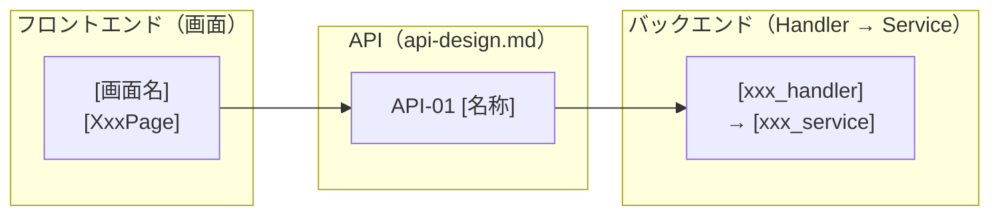

# コンポーネント設計

> 【分割テンプレート】このファイルは `docs/2_basic-design/functional-design/component-design.md` に配置する。
> 機能設計書の一部。親: [`functional-design.md`](../functional-design.md)。
> レイヤーごとの責務・インターフェース・依存を定義し、末尾に**画面 × API × モジュールの構成図**を示す。
> データモデルは [`data-model.md`](./data-model.md)、中核ロジックは [`domain-logic.md`](./domain-logic.md) を参照。

## [コンポーネント / レイヤー名]

**責務**:
- [責務1]
- [責務2]

**インターフェース**:
```typescript
interface [ComponentName] {
  [method1]([params]): [return];
  [method2]([params]): [return];
}
```

**依存関係**:
- 依存可能: [依存先]
- 依存禁止: [依存してはいけない先]

> 各レイヤーごとに上記ブロックを繰り返す。純粋ロジックを置く層は「外部依存なし」を明記し、
> テスト容易性の担保先であることを示す。

## モジュール構成図（画面 × API × バックエンド）

フロントエンドの画面と backend のモジュールを **API で紐づける俯瞰図**。データの正本は各資料に置く:
画面一覧＝[`screen-design.md`](./screen-design.md)、API一覧＝[`api-design.md`](./api-design.md)、
各モジュールの責務＝本ファイル上部の各層セクション。



**読み方**:
- 画面 → API: 各画面が呼ぶ API（詳細は [`screen-design.md`](./screen-design.md) の「主なAPI」列が正本）。
- API 定義: メソッド・パス・入出力は [`api-design.md`](./api-design.md) の API一覧が正本（ノードは同じ ID）。
- API → backend モジュール: 責務・依存は本ファイル上部の各層、物理配置は
  [リポジトリ構造定義書](../../3_detail-design/repository-structure.md)。

> API を追加・変更したら [`api-design.md`](./api-design.md) の一覧を更新し、本図も追随させる。
