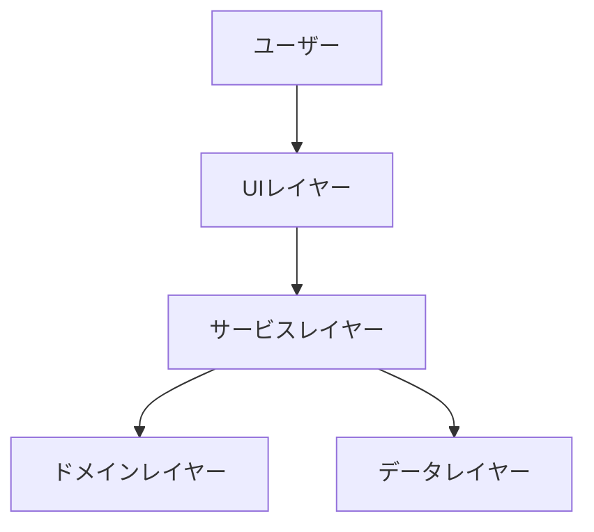

# 機能設計書 (Functional Design Document)

> 【索引テンプレート】このファイルは `docs/2_basic-design/functional-design.md` に配置する。
> 機能設計書は本ファイル（索引）＋ `functional-design/` 配下の分割ファイル群で構成する。
> 索引には全体像（システム構成図・技術スタック）と各分割ファイルへのリンクを置く。

## ドキュメント構成（索引）

| ファイル | 内容 |
|---|---|
| `functional-design.md`（本ファイル） | システム構成図・技術スタック・索引・詳細設計への申し送り |
| [`data-model.md`](./functional-design/data-model.md) | データモデル定義・ER図・制約 |
| [`component-design.md`](./functional-design/component-design.md) | レイヤー別コンポーネント設計（責務・IF・依存）＋モジュール構成図（画面×API×バックエンド） |
| [`usecase.md`](./functional-design/usecase.md) | ユースケース図（シーケンス） |
| [`screen-design.md`](./functional-design/screen-design.md) | 画面一覧・画面遷移図 |
| [`api-design.md`](./functional-design/api-design.md) | API設計（API一覧・req/res・エラー） |
| [`domain-logic.md`](./functional-design/domain-logic.md) | アルゴリズム設計（中核ロジック） |
| [`cross-cutting.md`](./functional-design/cross-cutting.md) | UI設計・エラーハンドリング・非機能・テスト戦略 |

## システム構成図

> レイヤーの方針を1〜数行で記述（依存の向き、純粋ロジックを置く層など）。

## 技術スタック

| 分類 | 技術 | 選定理由 |
|------|------|----------|
| 言語 | [言語名] | [理由] |
| フレームワーク | [名称] | [理由] |
| データベース | [名称] | [理由] |
| ツール | [名称] | [理由] |

> 技術選定の詳細な根拠は `docs/2_basic-design/architecture.md` を正本とする。

## 詳細設計への申し送り（未確定）

基本設計では確定させず、詳細設計フェーズで判断する論点を列挙する（各分割ファイルの該当箇所にも再掲）。

- [論点1] → 影響する分割ファイルへのリンク
- [論点2] → 影響する分割ファイルへのリンク
