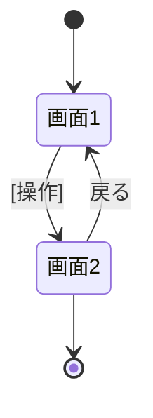

# 画面設計

> 【分割テンプレート】このファイルは `docs/2_basic-design/functional-design/screen-design.md` に配置する。
> 機能設計書の一部。親: [`functional-design.md`](../functional-design.md)。
> 画面一覧と画面遷移を定義する。**本ファイルの画面一覧を画面命名の正本**とし、
> UI コンポーネントの責務は [`component-design.md`](./component-design.md)、ユースケースの流れは
> [`usecase.md`](./usecase.md)、UI 表示仕様（色・状態表現など）は [`cross-cutting.md`](./cross-cutting.md) を参照。

## 画面一覧

> ルートはフロントエンドのパスであり、API パス（[`api-design.md`](./api-design.md)）とは別物。
> 「主なAPI」列を画面→API 対応の正本とし、俯瞰図は [`component-design.md`](./component-design.md) の「モジュール構成図」を参照。

| 画面名 | ルート(FE) | 対応コンポーネント | 目的 | 主な要素 | 主なAPI |
|---|---|---|---|---|---|
| [画面名] | `[/path]` | `[XxxPage]` | [目的] | [主な要素] | [呼ぶAPI] |

> 表示コンポーネントの責務は [`component-design.md`](./component-design.md) を参照。

## 画面遷移図

> ノード名は画面一覧の対応コンポーネント（例: `Dashboard`＝`DashboardPage`）に対応させる。
