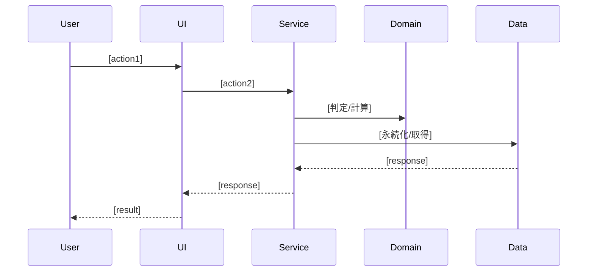

# ユースケース図

> 【分割テンプレート】このファイルは `docs/2_basic-design/functional-design/usecase.md` に配置する。
> 機能設計書の一部。親: [`functional-design.md`](../functional-design.md)。
> 主要ユースケースを、レイヤー横断のシーケンス（システム挙動）として定義する。
> 画面一覧・画面遷移は [`screen-design.md`](./screen-design.md)、各層の責務は
> [`component-design.md`](./component-design.md)、集計/判定アルゴリズムは [`domain-logic.md`](./domain-logic.md) を参照。

## ユースケース一覧

> まず主要ユースケースを一覧化し、各ユースケースのシーケンス詳細（下の該当セクション）へアンカーリンクする。

| ID | ユースケース | アクター | 目的 | 関連画面 |
|---|---|---|---|---|
| UC-01 | [[ユースケース名]](#ユースケース-ユースケース名) | [アクター] | [目的] | [関連画面] |

## ユースケース: [ユースケース名]

**フロー説明**:
1. [ステップ1]
2. [ステップ2]

> 主要ユースケースごとに上記シーケンスを繰り返す。集計・判定ロジックの詳細は
> [`domain-logic.md`](./domain-logic.md) へリンクする。
