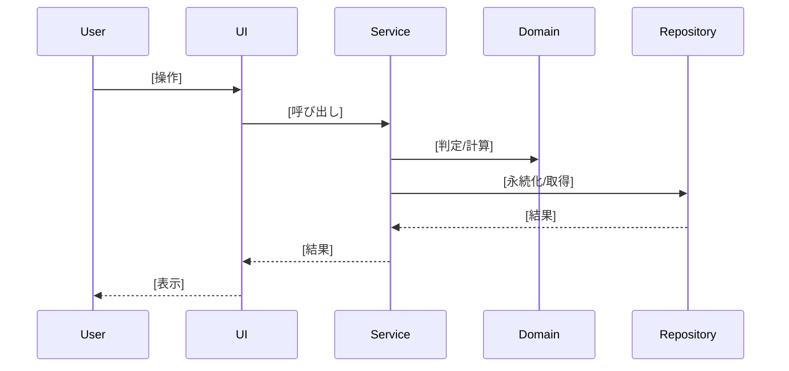

# 基本設計工程 実装詳細作成ガイド

このガイドは、`docs/baseline/functional-design.md`（機能設計書）をもとに、基本設計工程の実装詳細
（`docs/specs/2_basic-design/` の4ファイル）を作成するための実践的な指針を提供します。

> **成果物の配置**: 各ファイルのスケルトンは `SKILL.md`「テンプレートの参照」と `templates/` を参照。
> 本ガイドは中身を書くための手法。

## この4成果物が満たすべき性質

1. **正本と重複しない** — API・画面・UC の ID・名称・目的、データモデル、アルゴリズム仕様は baseline
   にある。本成果物はそれを**実装レベルまで詳細化**するのが役割で、同じ事実を再掲しない。baseline の
   一覧は「参照」する。
2. **ID で対応づける** — component-design のレイヤー、usecase のシーケンス、screen-design の画面、
   api-design のエンドポイントは、baseline の ID（UC-xx／API-xx／画面名）にそれぞれ対応させる。
3. **必要な時にだけ参照すればよい実装レベル** — JSON例・擬似インターフェース・シーケンス図フル・
   ワイヤーフレームなど、baseline に書くと指標としての見通しを損なう詳細をここに置く。
4. **曖昧な先送りを残さない** — ステータスコードの選定や項目の必須/任意など、この場で決まる粒度の
   事項は確定させる（「詳細設計で確定」のような先送りをしない）。

---

## パート1: component-design.md（コンポーネント設計）

### ステップ1: レイヤー構成の把握

baseline の「システム構成図」「モジュール構成図」からレイヤー構成（例: Handler / Service / Domain /
Repository / Frontend）を把握する。

### ステップ2: レイヤーごとに責務・インターフェース・依存関係を書く

各レイヤーについて、責務（何をするか）、インターフェース（擬似コード）、依存関係（依存可能／依存禁止）
を記述する。

**責務の書き方（例）**:
```
**責務**: ユーザー入力の受付、バリデーション、結果の表示
```

**インターフェース（擬似コード）の書き方**:
```typescript
class TaskManager {
  // タスクを作成する
  createTask(data: CreateTaskData): Task;
  // タスク一覧を取得する
  listTasks(filter?: FilterOptions): Task[];
}
```

**依存関係の書き方**:
```
**依存関係**: なし（Go の標準ライブラリのみ）。
```
または
```
**依存関係**:
- 依存可能: Domain層
- 依存禁止: Repository層への直接アクセス（Service層を経由すること）
```

### ステップ3: 外部依存を持たない層を明記する

ドメインロジック等、外部依存を持たない層は「外部依存なし」を明記する。これがテスト容易性の担保先で
あることを示す（PRD/baseline の非機能要件と対応させる）。

### 品質チェック
- [ ] レイヤーごとに責務・インターフェース・依存関係が揃っているか
- [ ] モジュール構成図（baseline）と対応しているか（二重管理していないか）
- [ ] 外部依存ゼロの層が明記されているか

---

## パート2: usecase.md（ユースケースのシーケンス図）

### ステップ1: baseline のユースケース一覧を確認

`docs/baseline/functional-design.md`「ユースケース一覧」の ID（UC-01…）・アクター・目的・関連画面を
確認する。一覧表そのものは再掲しない。

### ステップ2: UC-ID ごとにシーケンス図を書く

レイヤー横断（User → UI → Service → Domain → Repository 等）のシーケンスを mermaid で記述する。



参加者（participant）は component-design.md のレイヤー名と一致させる。集計・判定ロジックの詳細は
baseline「アルゴリズム設計」へのリンクに留め、ここでは呼び出し関係のみを示す。

### 品質チェック
- [ ] baseline の UC-ID すべてに対応するシーケンス図があるか
- [ ] participant 名が component-design.md のレイヤー名と一致しているか
- [ ] 一覧表（ID/アクター/目的）を再掲していないか（baseline 参照のみか）

---

## パート3: screen-design.md（画面設計）

### ステップ1: baseline の画面一覧・遷移図を確認

`docs/baseline/functional-design.md`「画面設計」の画面一覧（画面名・ルート・対応コンポーネント・
主なAPI）と遷移図を確認する。画面命名・遷移そのものは再掲しない。

### ステップ2: 画面ごとにレイアウトを書く

ASCII ワイヤーフレームで主要な配置を示す。実ピクセル指定は不要で、要素の有無と大まかな配置が伝われば
よい。

```
┌───────────────────────────────────────────────┐
│ [画面タイトル]                    [ナビゲーション] │
├───────────────────────────────────────────────┤
│ [主要リスト/フォーム領域]                          │
│ ┌─────────────────────────────────────────┐   │
│ │ [項目1]  [項目2]  [操作]                    │   │
│ └─────────────────────────────────────────┘   │
│ [サマリー/補助情報領域]                            │
└───────────────────────────────────────────────┘
```

### ステップ3: 画面項目定義を書く

項目・種別（表示/入力）・必須/任意・初期値or取得元API・入力チェック/備考を表で整理する。

| 項目 | 種別 | 必須 | 初期値／取得元 | 入力チェック／備考 |
|---|---|:--:|---|---|
| [項目名] | [表示/入力種別] | [必須/任意/条件付き] | [初期値 or 取得元 API-ID] | [制約。規則の正本は baseline / FR を参照] |

**選択によって項目の出し分けがある場合**（例: 区分によって必須項目が変わるフォーム）は、
「種別=Aのときのみ表示・必須」のように条件を明記する。整合規則そのものの正本は baseline の
データモデル整合表や要件定義書の該当 FR に置き、本書は「画面上でどう体現するか」に徹する
（規則を再定義しない）。

### ステップ4: 画面イベントを書く

操作ごとに、呼ぶ API（ID）・画面遷移・結果（反映方法）を表で整理する。

| 操作 | アクション | 結果 |
|---|---|---|
| [ユーザー操作] | [呼ぶ API-ID／遷移先] | [反映方法。楽観更新・再取得・遷移など] |

### ステップ5: 画面共通の状態表現

ローディング・エラー・空（0件）・正常の4状態を扱う場合は、共通事項として画面ごとの節の前に書く
（各画面で繰り返さない）。表示仕様の詳細は `docs/specs/_shared/cross-cutting.md`「UI設計」を参照。

### 品質チェック
- [ ] baseline の画面一覧すべてに対応する節があるか
- [ ] 項目定義に必須/任意（条件付きを含む）が明記されているか
- [ ] イベント表がすべて API-ID または遷移先で終端しているか（曖昧な「〜処理する」で終わっていないか）
- [ ] レイアウト・項目・イベント以外（色・状態表現）を書いていないか（cross-cutting.md との二重管理回避）

---

## パート4: api-design.md（API設計）

### ステップ1: baseline の API一覧を確認

`docs/baseline/functional-design.md`「API一覧」の ID（API-01…）・メソッド・パス・概要を確認する。
契約の正本（`openapi.yaml` 等）がある場合はその存在を明記し、本書は「主要な入出力の要約」に位置づける。

### ステップ2: API-ID ごとに入出力を書く

一覧表形式（複数APIをまとめて示せる場合）と、個別の例（JSON）を使い分ける。

**一覧表（同じ系統のAPIをまとめる）**:

| ID | 入力 | 出力 | 備考 |
|---|---|---|---|
| API-01 | [パラメータ] | [レスポンス型] | [補足] |

**個別の例（新規作成・複雑な入出力を持つAPI）**:

```
POST /[resource]
```

**リクエスト**:
```json
{
  "[field]": "[value]"
}
```

**レスポンス (201)**:
```json
{
  "id": "uuid",
  "[field]": "[value]"
}
```

データ型は baseline「データモデル」準拠であることを明記し、フィールドの型・制約をここで再定義しない。

### ステップ3: エラーレスポンスを書く

ステータスコードごとに発生条件を列挙する。**この場でステータスコードを確定させる**
（400 か 422 か、409 が必要か等を曖昧にしない）。

| ステータス | 条件 |
|---|---|
| 400 Bad Request | [バリデーション違反の内容] |
| 404 Not Found | [対象が存在しない場合] |
| 409 Conflict | [必要な場合のみ] |
| 422 Unprocessable Entity | [構文は正しいがビジネスルール上処理不可な場合] |
| 500 Internal Server Error | 予期せぬ障害 |

エラー分類と実際の表示メッセージは `docs/specs/_shared/cross-cutting.md`「エラーハンドリング」と
対応させる（メッセージ文言はそちらを正本とし、ここでは再掲しない）。

### ステップ4: 詳細設計への申し送り

ページング・フィルタ等、現時点で未確定の拡張は「必要になった時点で契約に追加し、baseline の
API一覧に ID を採番して追記する」という運用ルールを明記しておく（曖昧な先送りと、後から追加する
運用ルールの明記は別物。後者は許容される）。

### 品質チェック
- [ ] baseline の API-ID すべてに対応する記述があるか
- [ ] エラーレスポンスのステータスコードが確定しているか（後回しにしていないか）
- [ ] データ型を baseline から再定義せず参照しているか

---

## 全体の品質チェックリスト

- [ ] 4ファイルすべてが baseline の該当 ID（API/画面/UC）と一対一で対応しているか
- [ ] baseline に書かれている一覧・カタログ・データ型・アルゴリズム仕様を再掲していないか
- [ ] 各ファイルが「必要な時にだけ参照すればよい実装レベル」の記述に徹しているか
- [ ] 曖昧な先送り（「詳細設計で確定」等）が残っていないか
- [ ] 1ファイルずつ承認を得て進めているか（プロジェクト CLAUDE.md のルール）

## まとめ

基本設計工程 実装詳細作成の成功のポイント:

1. **baseline を正本として参照**し、二重管理しない
2. **ID で対応づける**（UC-ID／API-ID／画面名）ことで後工程からの追跡を保つ
3. **実装レベルの詳細に徹する**（JSON例・擬似コード・シーケンス図・ワイヤーフレーム）
4. **この場で決まることは確定させる**（ステータスコード・必須/任意の切り替えなど）
5. **1ファイルずつ承認**を得て進める
