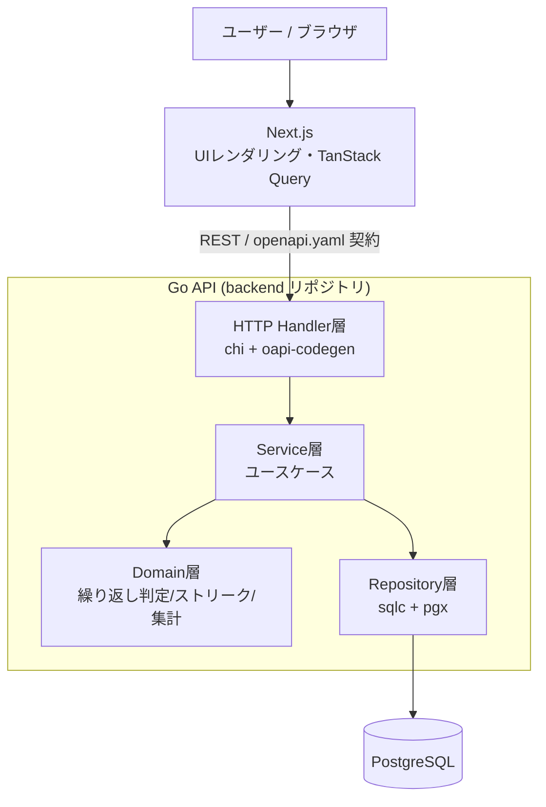

# 機能設計書 (Functional Design Document)

> PRD（`docs/1_requirements/product-requirements.md`）で定義した要件を、技術的にどう実現するかを
> 定義する基本設計の正本。**関心事ごとに複数ファイルへ分割**しており、本ファイルは全体像と索引を担う。
> 技術選定の詳細な根拠は `docs/2_basic-design/architecture.md` を参照。
> 第一マイルストーン（登録→チェックイン→可視化、単一ユーザー前提）を対象とする。

## ドキュメント構成（索引）

| ファイル | 内容 |
|---|---|
| `functional-design.md`（本ファイル） | システム構成図・技術スタック・レイヤー方針・索引・詳細設計への申し送り |
| [`data-model.md`](./functional-design/data-model.md) | データモデル定義（Habit / CheckIn）・ER図・制約 |
| [`component-design.md`](./functional-design/component-design.md) | レイヤー別コンポーネント設計（責務・インターフェース・依存）＋モジュール構成図（画面 × API × バックエンド） |
| [`usecase.md`](./functional-design/usecase.md) | ユースケース図（主要フローのシーケンス＝システム挙動） |
| [`screen-design.md`](./functional-design/screen-design.md) | 画面設計（画面一覧・画面遷移図） |
| [`api-design.md`](./functional-design/api-design.md) | API設計（API一覧＝カタログ・入出力概要・エラー） |
| [`domain-logic.md`](./functional-design/domain-logic.md) | アルゴリズム設計（対象日判定・ストリーク・達成率・ヒートマップ）＝本アプリの中核 |
| [`cross-cutting.md`](./functional-design/cross-cutting.md) | UI設計・エラーハンドリング・パフォーマンス・セキュリティ・テスト戦略 |

## システム構成図

3リポジトリ（docs / backend / frontend）構成。ブラウザ（Next.js が配信する SPA 相当の UI）から
Go API（REST）を直接呼び出し、Go API が PostgreSQL を読み書きする。Next.js は BFF にせず、
UI レンダリングに専念する。

**レイヤーの方針**:
- **Domain層は外部依存ゼロ**（DB・HTTP を知らない純粋なロジック）。繰り返し判定・ストリーク計算・
  集計はここに置き、単体テストで網羅する（PRD の主眼＝テスト容易性）。詳細は
  [`domain-logic.md`](./functional-design/domain-logic.md)・[`component-design.md`](./functional-design/component-design.md)。
- Service層がユースケースを組み立て、Repository を介して永続化する。
- Handler層は OpenAPI 契約から生成した型で入出力を受け、Service に委譲する。

## 技術スタック

| 分類 | 技術 | 選定理由 |
|------|------|----------|
| バックエンド言語 | Go | 堅い型・明示的な設計でドメインロジック/テスト設計が映える |
| HTTPルーター | chi | net/http 互換の軽量ルーター |
| API契約 | OpenAPI + oapi-codegen | `openapi.yaml` を正本に Go サーバ型/スタブを生成 |
| DBアクセス | sqlc + pgx | SQL から型安全な Go コードを生成。集計クエリが見える |
| マイグレーション | golang-migrate | up/down SQL をバージョン管理 |
| データベース | PostgreSQL | 日付/期間集計が強く、将来のマルチユーザー化に拡張可能 |
| フロントフレームワーク | Next.js (React + TypeScript) | React ベースの定番。UIレンダリングに専念 |
| データ取得 | TanStack Query | キャッシュ/再取得/楽観更新 |
| スタイル/UI | Tailwind CSS + shadcn/ui | 定番・学習価値が高い |
| API型（フロント） | OpenAPI から TS クライアント型を生成 | 契約不一致を防ぐ |
| テスト | testify / testcontainers-go / Vitest / Playwright | 単体・DB結合・FE単体・E2E結合 |

詳細は `architecture.md` を正本とする。

## 詳細設計への申し送り（未確定）

以下は基本設計では確定させず、詳細設計フェーズで判断する（各分割ファイルの該当箇所にも再掲）。
`docs/0_ideas/tech-stack.md`・PRD の未決事項とも対応する。

- タイムゾーン・日付境界（サーバー時刻基準/ユーザーTZ）→ 影響は [`domain-logic.md`](./functional-design/domain-logic.md)
- `weekly_count` の週の起点と週ストリーク/達成率の厳密仕様 → [`domain-logic.md`](./functional-design/domain-logic.md)
- 非対象日への記録リクエストの扱い（拒否コード）→ [`api-design.md`](./functional-design/api-design.md)・[`cross-cutting.md`](./functional-design/cross-cutting.md)
- リマインド超過判定の基準（当日のみ/サーバー時刻）→ [`cross-cutting.md`](./functional-design/cross-cutting.md)
