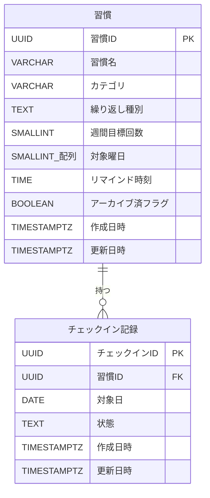

# データモデル定義

> 機能設計書の一部。親: [`functional-design.md`](../functional-design.md)。
> 第一マイルストーンのエンティティは **Habit（習慣）** と **CheckIn（チェックイン記録）** の2つ。
> 将来の認証追加に備え、`Habit` にユーザー分離を後付けできる余地を残す（第一版では持たない）。

フィールドと物理制約の**正本は後述の「テーブル定義（物理スキーマ）」の表**とする。本節では、表で
表しづらいエンティティの区分値とドメイン上の意味だけを補足する（概念モデルの camelCase 名と
物理カラム snake_case は対応する。例: `recurrenceType` ↔ `recurrence_type`）。

## エンティティと区分値

- エンティティは **Habit（習慣）** と **CheckIn（チェックイン記録）** の2つ。関係は **Habit 1 ―― * CheckIn**。
- コード・API・ドメインロジックで用いる区分値（型名と取りうる値）:
  - `RecurrenceType` = `daily` | `weekly_count` | `specific_days`
  - `CheckInStatus` = `done` | `not_done`

## ドメイン上の制約（物理スキーマで表現しないもの）

物理的な制約（型・NULL・一意・CHECK）はテーブル定義の表を正本とする。以下は DB では担保せず、
ドメイン層で扱う意味・ルール:

- `check_ins.date` は習慣の繰り返しルール上「対象日」であること。**非対象日への記録は原則しない
  （判定は Domain層。DB制約ではない）**。対象日判定は [`domain-logic.md`](./domain-logic.md) を参照。
- `not_done`（明示的な未達成）とレコードなし（未記録）は区別しうるが、集計では「対象日かつ done でない」を
  未達成として扱う（詳細は [`domain-logic.md`](./domain-logic.md) の集計アルゴリズム）。
- 習慣の削除は物理削除ではなく `archived=true`（論理削除）で行い、過去のチェックイン記録との整合を保つ。

## ER図

エンティティ・属性は日本語の論理名で示す（物理名との対応はテーブル定義の表を参照）。

## テーブル定義（物理スキーマ）

以下のカラム定義表を**正本**とする。物理DDL（`golang-migrate` の up/down SQL）は本表を基に、
詳細設計／マイグレーション実装のタイミングで生成する（`sqlc` はそのDDLを入力に型安全な Go コードを生成）。
概念モデルの camelCase フィールドは、テーブルでは snake_case カラムに対応する
（例: `recurrenceType` ↔ `recurrence_type`）。

### habits テーブル（論理名: 習慣）

| カラム（物理名） | 論理名 | 型 | NULL | デフォルト | 説明 |
|---|---|---|:--:|---|---|
| `id` | 習慣ID | UUID | 不可 | `gen_random_uuid()` | 主キー |
| `name` | 習慣名 | VARCHAR(100) | 不可 | — | 1〜100文字 |
| `category` | カテゴリ | VARCHAR(100) | 可 | — | 任意カテゴリ |
| `recurrence_type` | 繰り返し種別 | TEXT | 不可 | — | `daily` / `weekly_count` / `specific_days` |
| `weekly_target_count` | 週間目標回数 | SMALLINT | 可 | — | `weekly_count` 時のみ 1〜7 |
| `target_weekdays` | 対象曜日 | SMALLINT[] | 可 | — | `specific_days` 時のみ。要素は 0(日)〜6(土) |
| `reminder_time` | リマインド時刻 | TIME | 可 | — | `HH:MM` 相当。保持のみ（実配信なし） |
| `archived` | アーカイブ済フラグ | BOOLEAN | 不可 | `FALSE` | 論理削除フラグ |
| `created_at` | 作成日時 | TIMESTAMPTZ | 不可 | `now()` | 作成日時 |
| `updated_at` | 更新日時 | TIMESTAMPTZ | 不可 | `now()` | 更新時に更新 |

**制約・インデックス**

| 名前 | 種別 | 内容 |
|---|---|---|
| （主キー） | PK | `id` |
| `habits_name_len` | CHECK | `name` は 1〜100 文字 |
| `habits_recurrence_type_valid` | CHECK | `recurrence_type` ∈ { `daily`, `weekly_count`, `specific_days` } |
| `habits_recurrence_consistency` | CHECK | 繰り返しルールと付随項目の整合（下表） |

繰り返しルール整合（`habits_recurrence_consistency` の内容）:

| `recurrence_type` | `weekly_target_count` | `target_weekdays` |
|---|---|---|
| `daily` | NULL | NULL |
| `weekly_count` | 1〜7（必須） | NULL |
| `specific_days` | NULL | 1要素以上・各要素 0〜6（必須） |

### check_ins テーブル（論理名: チェックイン記録）

| カラム（物理名） | 論理名 | 型 | NULL | デフォルト | 説明 |
|---|---|---|:--:|---|---|
| `id` | チェックインID | UUID | 不可 | `gen_random_uuid()` | 主キー |
| `habit_id` | 習慣ID | UUID | 不可 | — | `habits(id)` への外部キー |
| `date` | 対象日 | DATE | 不可 | — | 記録対象の日付（時刻は持たない） |
| `status` | 状態 | TEXT | 不可 | — | `done` / `not_done` |
| `created_at` | 作成日時 | TIMESTAMPTZ | 不可 | `now()` | 作成日時 |
| `updated_at` | 更新日時 | TIMESTAMPTZ | 不可 | `now()` | 更新日時 |

**制約・インデックス**

| 名前 | 種別 | 内容 |
|---|---|---|
| （主キー） | PK | `id` |
| `check_ins_habit_id_fkey` | FK | `habit_id` → `habits(id)`（`ON DELETE CASCADE`） |
| `check_ins_status_valid` | CHECK | `status` ∈ { `done`, `not_done` } |
| `check_ins_habit_date_unique` | UNIQUE | (`habit_id`, `date`)。同一習慣・同一日で重複不可。upsert の競合ターゲット |
| `idx_check_ins_date` | INDEX | (`date`)。日付起点の取得（`listByDate`）用 |

**設計メモ**:
- `gen_random_uuid()` は PostgreSQL 13+ で組み込み（本プロジェクトは 16 以降を想定）。
- `UNIQUE (habit_id, date)` が張る索引を `listByHabitInRange`（習慣×期間）と upsert の競合判定に利用。
  日付起点の取得には別途 `idx_check_ins_date` を用いる。
- `habits` は論理削除（`archived`）を基本とするため物理削除は通常発生しないが、FK は
  `ON DELETE CASCADE` とし、万一の物理削除時も孤児レコードを残さない。
- `updated_at` の更新方式（アプリ設定／更新トリガー）と `reminder_time` の型（`TIME` / `VARCHAR(5)`）は
  詳細設計で最終確定（本書では `TIME`）。
