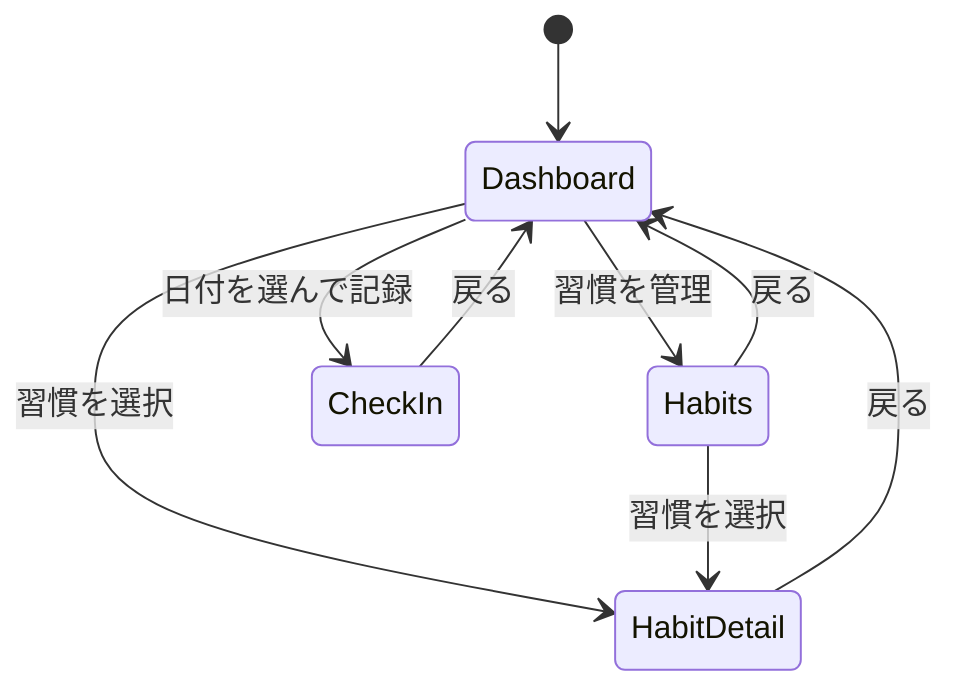

# 画面設計

> 機能設計書の一部。親: [`functional-design.md`](../functional-design.md)。
> 画面一覧と画面遷移を定義する。**本ファイルの画面一覧を画面命名の正本**とし、
> UI コンポーネントの責務は [`component-design.md`](./component-design.md)、ユースケースの流れは
> [`usecase.md`](./usecase.md)、UI 表示仕様（色・状態表現など）は [`cross-cutting.md`](./cross-cutting.md) を参照。

## 画面一覧

第一マイルストーン（登録→チェックイン→可視化、単一ユーザー前提）の画面。
ルートはフロントエンド（Next.js）のパスであり、API パス（[`api-design.md`](./api-design.md)）とは別物。

| 画面名 | ルート(FE) | 対応コンポーネント | 目的 | 主な要素 | 主なAPI |
|---|---|---|---|---|---|
| ダッシュボード | `/` | `DashboardPage` | 当日の対象習慣とサマリーを一望する | 当日チェックインリスト、リマインド超過ハイライト、ストリーク、達成率、ヒートマップ | `GET /check-ins?date=today`、`GET /dashboard` |
| 習慣管理 | `/habits` | `HabitsPage` | 習慣の一覧・作成・編集・アーカイブ | 習慣一覧、作成/編集フォーム、アーカイブ操作 | `GET /habits`、`POST /habits`、`PUT /habits/{id}`、`DELETE /habits/{id}` |
| 日付指定チェックイン | `/check-ins?date=YYYY-MM-DD` | `CheckInPage` | 過去日を選んで対象習慣を記録する | 日付ピッカー、対象習慣リスト、完了/未完了トグル | `GET /check-ins?date=`、`PUT /habits/{id}/check-ins/{date}` |
| 習慣詳細 | `/habits/{id}` | `HabitDetailPage` | 個別習慣の推移を確認する | 達成率リング、ストリークバッジ、ヒートマップカレンダー | `GET /habits/{id}`、`GET /dashboard` |

> 表示コンポーネント（`HeatmapCalendar` / `StreakBadge` / `AchievementRing` など）の責務は
> [`component-design.md`](./component-design.md) を参照。

## 画面遷移図

> ノード名は画面一覧の対応コンポーネント（`Dashboard`＝`DashboardPage` 等）に対応する。
