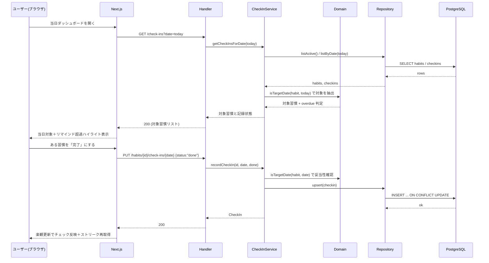
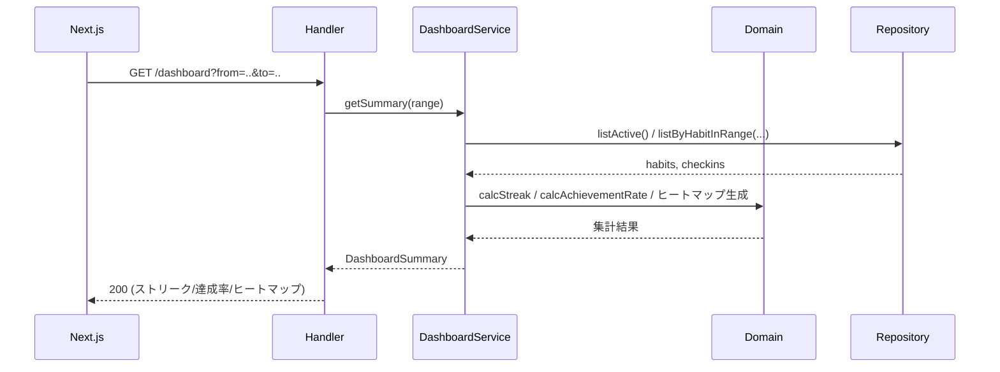

# ユースケース図

> 機能設計書の一部。親: [`functional-design.md`](../functional-design.md)。
> 主要ユースケースを、レイヤー横断のシーケンス（システム挙動）として定義する。
> 画面一覧・画面遷移は [`screen-design.md`](./screen-design.md)、各層の責務は
> [`component-design.md`](./component-design.md)、集計アルゴリズムは [`domain-logic.md`](./domain-logic.md) を参照。

## ユースケース一覧

第一マイルストーン（登録→チェックイン→可視化、単一ユーザー前提）の主要ユースケース。
各ユースケースのシーケンス詳細は以下の該当セクションを参照。

| ID | ユースケース | アクター | 目的 | 関連画面 |
|---|---|---|---|---|
| UC-01 | [日次チェックイン](#ユースケース-日次チェックイン) | ユーザー | 当日の対象習慣を一覧し、完了/未完了を記録する | ダッシュボード、日付指定チェックイン |
| UC-02 | [可視化（ダッシュボード集計）](#ユースケース-可視化ダッシュボード集計) | ユーザー | ストリーク・達成率・ヒートマップを集計して確認する | ダッシュボード、習慣詳細 |

## ユースケース: 日次チェックイン

## ユースケース: 可視化（ダッシュボード集計）

集計アルゴリズムの詳細は [`domain-logic.md`](./domain-logic.md) を参照。
