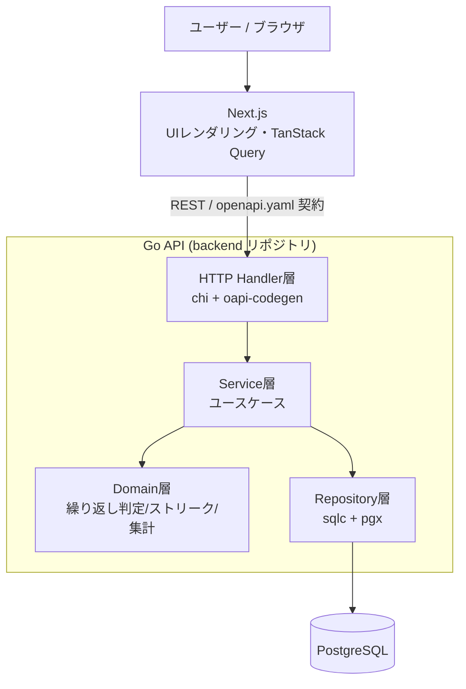
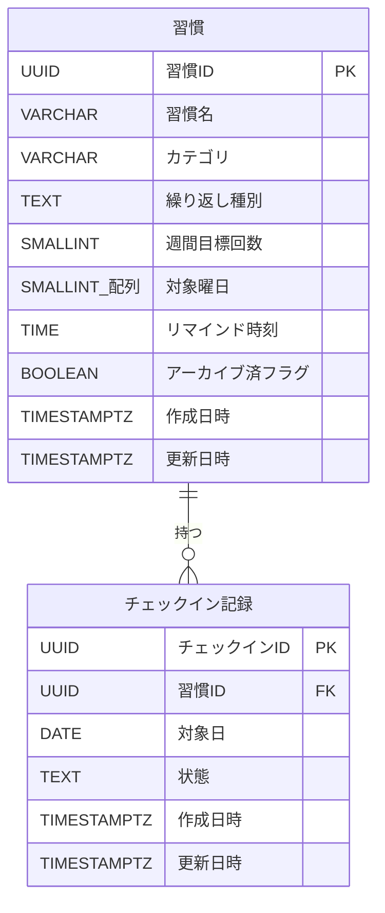
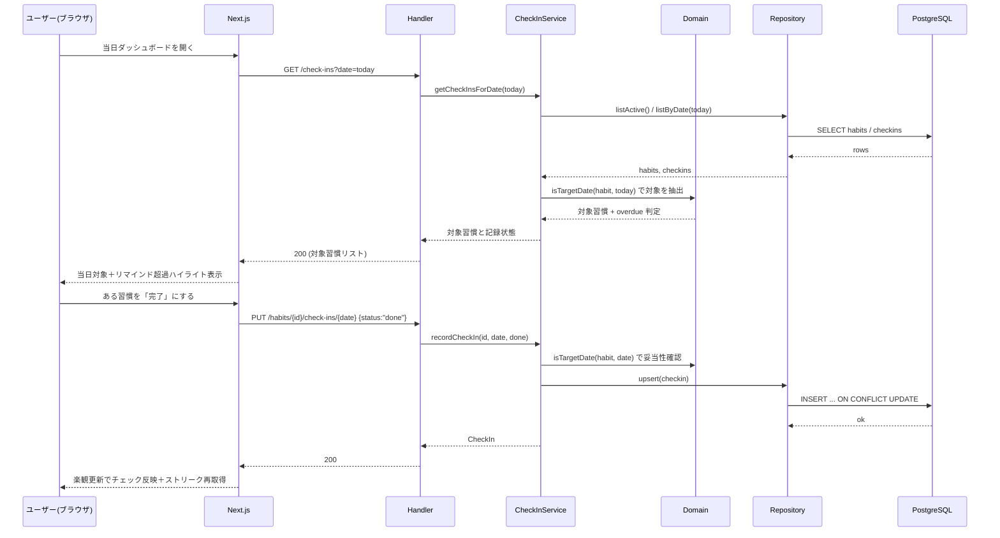
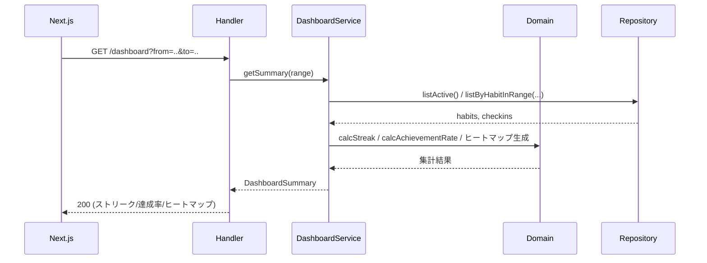
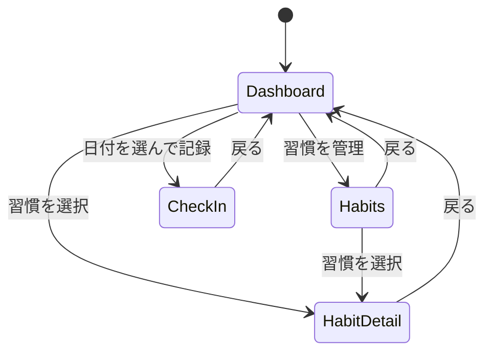

# 機能設計書 (Functional Design Document)

> PRD（`docs/baseline/product-requirements.md`）で定義した要件を、技術的にどう実現するかを
> 定義する基本設計の正本。**単一ファイル**として全体像・データモデル・コンポーネント設計・
> ユースケース・画面設計・API設計・アルゴリズム設計・横断的関心事を管理する。
> より詳細な設計（機能単位の深掘りなど）は `docs/specs/2_basic-design/` に作業単位で追加していく。
> 技術選定の詳細な根拠は `docs/baseline/architecture.md` を参照。
> 第一マイルストーン（登録→チェックイン→可視化、単一ユーザー前提）を対象とする。

## システム構成図

3リポジトリ（docs / backend / frontend）構成。ブラウザ（Next.js が配信する SPA 相当の UI）から
Go API（REST）を直接呼び出し、Go API が PostgreSQL を読み書きする。Next.js は BFF にせず、
UI レンダリングに専念する。



**レイヤーの方針**:
- **Domain層は外部依存ゼロ**（DB・HTTP を知らない純粋なロジック）。繰り返し判定・ストリーク計算・
  集計はここに置き、単体テストで網羅する（PRD の主眼＝テスト容易性）。詳細は
  「アルゴリズム設計（ドメインロジック）」「コンポーネント設計」の各節を参照。
- Service層がユースケースを組み立て、Repository を介して永続化する。
- Handler層は OpenAPI 契約から生成した型で入出力を受け、Service に委譲する。

## 技術スタック

| 分類 | 技術 | 選定理由 |
|------|------|----------|
| バックエンド言語 | Go | 堅い型・明示的な設計でドメインロジック/テスト設計が映える |
| HTTPルーター | chi | net/http 互換の軽量ルーター |
| API契約 | OpenAPI + oapi-codegen | `openapi.yaml` を正本に Go サーバ型/スタブを生成 |
| DBアクセス | sqlc + pgx | SQL から型安全な Go コードを生成。集計クエリが見える |
| マイグレーション | golang-migrate | up/down SQL をバージョン管理 |
| データベース | PostgreSQL | 日付/期間集計が強く、将来のマルチユーザー化に拡張可能 |
| フロントフレームワーク | Next.js (React + TypeScript) | React ベースの定番。UIレンダリングに専念 |
| データ取得 | TanStack Query | キャッシュ/再取得/楽観更新 |
| スタイル/UI | Tailwind CSS + shadcn/ui | 定番・学習価値が高い |
| API型（フロント） | OpenAPI から TS クライアント型を生成 | 契約不一致を防ぐ |
| テスト | testify / testcontainers-go / Vitest / Playwright | 単体・DB結合・FE単体・E2E結合 |

詳細は `architecture.md` を正本とする。

## データモデル

第一マイルストーンのエンティティは **Habit（習慣）** と **CheckIn（チェックイン記録）** の2つ。
将来の認証追加に備え、`Habit` にユーザー分離を後付けできる余地を残す（第一版では持たない）。

フィールドと物理制約の**正本は後述の「テーブル定義（物理スキーマ）」の表**とする。本節では、表で
表しづらいエンティティの区分値とドメイン上の意味だけを補足する（概念モデルの camelCase 名と
物理カラム snake_case は対応する。例: `recurrenceType` ↔ `recurrence_type`）。

### エンティティと区分値

- エンティティは **Habit（習慣）** と **CheckIn（チェックイン記録）** の2つ。関係は **Habit 1 ―― * CheckIn**。
- コード・API・ドメインロジックで用いる区分値（型名と取りうる値）:
  - `RecurrenceType` = `daily` | `weekly_count` | `specific_days`
  - `CheckInStatus` = `done` | `not_done`

### ドメイン上の制約（物理スキーマで表現しないもの）

物理的な制約（型・NULL・一意・CHECK）はテーブル定義の表を正本とする。以下は DB では担保せず、
ドメイン層で扱う意味・ルール:

- `check_ins.date` は習慣の繰り返しルール上「対象日」であること。**非対象日への記録は原則しない
  （判定は Domain層。DB制約ではない）**。対象日判定は「アルゴリズム設計（ドメインロジック）」を参照。
- `not_done`（明示的な未達成）とレコードなし（未記録）は区別しうるが、集計では「対象日かつ done でない」を
  未達成として扱う（詳細は「アルゴリズム設計（ドメインロジック）」の集計アルゴリズム）。
- 習慣の削除は物理削除ではなく `archived=true`（論理削除）で行い、過去のチェックイン記録との整合を保つ。

### ER図

エンティティ・属性は日本語の論理名で示す（物理名との対応はテーブル定義の表を参照）。



### テーブル定義（物理スキーマ）

以下のカラム定義表を**正本**とする。物理DDL（`golang-migrate` の up/down SQL）は本表を基に、
詳細設計／マイグレーション実装のタイミングで生成する（`sqlc` はそのDDLを入力に型安全な Go コードを生成）。
概念モデルの camelCase フィールドは、テーブルでは snake_case カラムに対応する
（例: `recurrenceType` ↔ `recurrence_type`）。

#### habits テーブル（論理名: 習慣）

| カラム（物理名） | 論理名 | 型 | NULL | デフォルト | 説明 |
|---|---|---|:--:|---|---|
| `id` | 習慣ID | UUID | 不可 | `gen_random_uuid()` | 主キー |
| `name` | 習慣名 | VARCHAR(100) | 不可 | — | 1〜100文字 |
| `category` | カテゴリ | VARCHAR(100) | 可 | — | 任意カテゴリ |
| `recurrence_type` | 繰り返し種別 | TEXT | 不可 | — | `daily` / `weekly_count` / `specific_days` |
| `weekly_target_count` | 週間目標回数 | SMALLINT | 可 | — | `weekly_count` 時のみ 1〜7 |
| `target_weekdays` | 対象曜日 | SMALLINT[] | 可 | — | `specific_days` 時のみ。要素は 0(日)〜6(土) |
| `reminder_time` | リマインド時刻 | TIME | 可 | — | `HH:MM` 相当。保持のみ（実配信なし） |
| `archived` | アーカイブ済フラグ | BOOLEAN | 不可 | `FALSE` | 論理削除フラグ |
| `created_at` | 作成日時 | TIMESTAMPTZ | 不可 | `now()` | 作成日時 |
| `updated_at` | 更新日時 | TIMESTAMPTZ | 不可 | `now()` | 更新時に更新 |

**制約・インデックス**

| 名前 | 種別 | 内容 |
|---|---|---|
| （主キー） | PK | `id` |
| `habits_name_len` | CHECK | `name` は 1〜100 文字 |
| `habits_recurrence_type_valid` | CHECK | `recurrence_type` ∈ { `daily`, `weekly_count`, `specific_days` } |
| `habits_recurrence_consistency` | CHECK | 繰り返しルールと付随項目の整合（下表） |

繰り返しルール整合（`habits_recurrence_consistency` の内容）:

| `recurrence_type` | `weekly_target_count` | `target_weekdays` |
|---|---|---|
| `daily` | NULL | NULL |
| `weekly_count` | 1〜7（必須） | NULL |
| `specific_days` | NULL | 1要素以上・各要素 0〜6（必須） |

#### check_ins テーブル（論理名: チェックイン記録）

| カラム（物理名） | 論理名 | 型 | NULL | デフォルト | 説明 |
|---|---|---|:--:|---|---|
| `id` | チェックインID | UUID | 不可 | `gen_random_uuid()` | 主キー |
| `habit_id` | 習慣ID | UUID | 不可 | — | `habits(id)` への外部キー |
| `date` | 対象日 | DATE | 不可 | — | 記録対象の日付（時刻は持たない） |
| `status` | 状態 | TEXT | 不可 | — | `done` / `not_done` |
| `created_at` | 作成日時 | TIMESTAMPTZ | 不可 | `now()` | 作成日時 |
| `updated_at` | 更新日時 | TIMESTAMPTZ | 不可 | `now()` | 更新日時 |

**制約・インデックス**

| 名前 | 種別 | 内容 |
|---|---|---|
| （主キー） | PK | `id` |
| `check_ins_habit_id_fkey` | FK | `habit_id` → `habits(id)`（`ON DELETE CASCADE`） |
| `check_ins_status_valid` | CHECK | `status` ∈ { `done`, `not_done` } |
| `check_ins_habit_date_unique` | UNIQUE | (`habit_id`, `date`)。同一習慣・同一日で重複不可。upsert の競合ターゲット |
| `idx_check_ins_date` | INDEX | (`date`)。日付起点の取得（`listByDate`）用 |

**設計メモ**:
- `gen_random_uuid()` は PostgreSQL 13+ で組み込み（本プロジェクトは 16 以降を想定）。
- `UNIQUE (habit_id, date)` が張る索引を `listByHabitInRange`（習慣×期間）と upsert の競合判定に利用。
  日付起点の取得には別途 `idx_check_ins_date` を用いる。
- `habits` は論理削除（`archived`）を基本とするため物理削除は通常発生しないが、FK は
  `ON DELETE CASCADE` とし、万一の物理削除時も孤児レコードを残さない。
- `updated_at` の更新方式（アプリ設定／更新トリガー）と `reminder_time` の型（`TIME` / `VARCHAR(5)`）は
  詳細設計で最終確定（本書では `TIME`）。

## コンポーネント設計

レイヤー別（Handler / Service / Domain / Repository / Frontend）の責務・インターフェース・依存を定義し、
末尾に**画面 × API × モジュールの構成図**を示す。

### Domain層（backend / 外部依存なし・テストの主対象）

**責務**:
- ある日付が習慣の対象日かを判定する（繰り返しルール解釈）。
- チェックイン記録列からストリーク（現在・最長）を算出する。
- 週次・月次の達成率とヒートマップ用データを集計する。

**インターフェース（擬似）**:
```typescript
// 繰り返し判定
function isTargetDate(habit: Habit, date: string): boolean;

// 期間内の対象日一覧
function targetDatesInRange(habit: Habit, from: string, to: string): string[];

// ストリーク算出（対象外の日は連続を途切れさせない／対象日の未達成で途切れる）
function calcStreak(habit: Habit, checkIns: CheckIn[], today: string): {
  current: number;
  longest: number;
};

// 達成率（対象日に対する done の割合）
function calcAchievementRate(habit: Habit, checkIns: CheckIn[], from: string, to: string): number;
```

**依存関係**: なし（Go の標準ライブラリのみ）。ロジックの詳細は「アルゴリズム設計（ドメインロジック）」。

### Repository層（backend）

**責務**: Habit・CheckIn の永続化と取得（sqlc 生成コード + pgx）。

**インターフェース（擬似）**:
```typescript
interface HabitRepository {
  create(h: Habit): Habit;
  update(h: Habit): Habit;
  archive(id: string): void;
  findById(id: string): Habit | null;
  listActive(): Habit[];
}

interface CheckInRepository {
  upsert(c: CheckIn): CheckIn;                       // (habitId,date) で upsert
  listByHabitInRange(habitId: string, from: string, to: string): CheckIn[];
  listByDate(date: string): CheckIn[];
}
```

**依存関係**: PostgreSQL（pgx コネクション）。

### Service層（backend）

**責務**: ユースケースの組み立て。Domain層で判定・計算し、Repository で永続化する。

**主なユースケース**:
```typescript
interface HabitService {
  createHabit(input): Habit;              // バリデーション→保存
  updateHabit(id, input): Habit;
  deleteHabit(id): void;                  // archive
  listHabits(): Habit[];
}

interface CheckInService {
  // 指定日の対象習慣＋現在の記録状態を返す（ダッシュボード/チェックイン画面用）
  getCheckInsForDate(date): { habit: Habit; status: CheckInStatus | null; overdue: boolean }[];
  // 完了/未完了を記録（対象日判定→upsert→関連集計の再計算はGET側で都度算出）
  recordCheckIn(habitId, date, status): CheckIn;
}

interface DashboardService {
  // 習慣ごとのストリーク・達成率・ヒートマップを集約
  getSummary(range): DashboardSummary;
}
```

### Handler層（backend）

**責務**: OpenAPI 契約から生成した型で HTTP 入出力を受け、Service に委譲。バリデーションエラー・
NotFound を HTTP ステータスに変換する。エンドポイント仕様は「API設計」を参照。

### フロントエンド（frontend / Next.js）

**責務**: 画面描画とユーザー操作。TanStack Query で Go API を呼び、キャッシュ・楽観更新を行う。
OpenAPI から生成した TS クライアント型を用いる。

**主なコンポーネント**:
- ページコンポーネント（`DashboardPage` / `HabitsPage` / `CheckInPage` / `HabitDetailPage`）。
  各ページの目的・ルート・扱うデータの一覧は「画面設計」の画面一覧を正本とする。
- `HeatmapCalendar`・`StreakBadge`・`AchievementRing` などの表示コンポーネント。

画面一覧・画面遷移は「画面設計」、ユースケースの流れは「ユースケース」、UI 表示仕様は
「横断的関心事」を参照。

### モジュール構成図（画面 × API × バックエンド）

フロントエンドの画面と backend のモジュールを API で紐づけた俯瞰図。対応データの正本は各節に置く:
画面一覧＝「画面設計」、API一覧＝「API設計」、各モジュールの責務＝本節上部の各層セクション。


**読み方**:
- 画面 → API: 各画面が呼ぶ API（詳細は「画面設計」の「主なAPI」列が正本）。
- API 定義: メソッド・パス・入出力は「API設計」の API一覧が正本（ノードは同じ ID）。
- API → backend モジュール: `habit_*`＝習慣CRUD、`checkin_*`＝チェックイン、`dashboard_*`＝集計。
  責務・依存は本節上部の各層、物理配置は [リポジトリ構造定義書](repository-structure.md)。

> API を追加・変更したら「API設計」の一覧を更新し、本図も追随させる。

## ユースケース

主要ユースケースを、レイヤー横断のシーケンス（システム挙動）として定義する。
画面一覧・画面遷移は「画面設計」、各層の責務は「コンポーネント設計」、集計アルゴリズムは
「アルゴリズム設計（ドメインロジック）」を参照。

### ユースケース一覧

第一マイルストーン（登録→チェックイン→可視化、単一ユーザー前提）の主要ユースケース。
各ユースケースのシーケンス詳細は以下の該当セクションを参照。

| ID | ユースケース | アクター | 目的 | 関連画面 |
|---|---|---|---|---|
| UC-01 | [日次チェックイン](#ユースケース-日次チェックイン) | ユーザー | 当日の対象習慣を一覧し、完了/未完了を記録する | ダッシュボード、日付指定チェックイン |
| UC-02 | [可視化（ダッシュボード集計）](#ユースケース-可視化ダッシュボード集計) | ユーザー | ストリーク・達成率・ヒートマップを集計して確認する | ダッシュボード、習慣詳細 |

### ユースケース: 日次チェックイン



### ユースケース: 可視化（ダッシュボード集計）



集計アルゴリズムの詳細は「アルゴリズム設計（ドメインロジック）」を参照。

## 画面設計

画面一覧と画面遷移を定義する。**本節の画面一覧を画面命名の正本**とし、UI コンポーネントの責務は
「コンポーネント設計」、ユースケースの流れは「ユースケース」、UI 表示仕様（色・状態表現など）は
「横断的関心事」を参照。

### 画面一覧

第一マイルストーン（登録→チェックイン→可視化、単一ユーザー前提）の画面。
ルートはフロントエンド（Next.js）のパスであり、API パス（「API設計」）とは別物。

| 画面名 | ルート(FE) | 対応コンポーネント | 目的 | 主な要素 | 主なAPI |
|---|---|---|---|---|---|
| ダッシュボード | `/` | `DashboardPage` | 当日の対象習慣とサマリーを一望する | 当日チェックインリスト、リマインド超過ハイライト、ストリーク、達成率、ヒートマップ | `GET /check-ins?date=today`、`GET /dashboard` |
| 習慣管理 | `/habits` | `HabitsPage` | 習慣の一覧・作成・編集・アーカイブ | 習慣一覧、作成/編集フォーム、アーカイブ操作 | `GET /habits`、`POST /habits`、`PUT /habits/{id}`、`DELETE /habits/{id}` |
| 日付指定チェックイン | `/check-ins?date=YYYY-MM-DD` | `CheckInPage` | 過去日を選んで対象習慣を記録する | 日付ピッカー、対象習慣リスト、完了/未完了トグル | `GET /check-ins?date=`、`PUT /habits/{id}/check-ins/{date}` |
| 習慣詳細 | `/habits/{id}` | `HabitDetailPage` | 個別習慣の推移を確認する | 達成率リング、ストリークバッジ、ヒートマップカレンダー | `GET /habits/{id}`、`GET /dashboard` |

> 表示コンポーネント（`HeatmapCalendar` / `StreakBadge` / `AchievementRing` など）の責務は
> 「コンポーネント設計」を参照。

### 画面遷移図



> ノード名は画面一覧の対応コンポーネント（`Dashboard`＝`DashboardPage` 等）に対応する。

## API設計

REST / JSON。`openapi.yaml`（正本は backend リポジトリ）を契約の正本とし、**完全なスキーマ・型はそこで確定**する。
本節は **API一覧（カタログ）** と主要な入出力の概要を管理する。データ型は「データモデル」、
画面との紐付けは「コンポーネント設計」の「モジュール構成図」を参照。
第一マイルストーンは単一ユーザー前提のため認証はなし（スコープ外）。

### API一覧

API名・ID は本一覧を正本とする（他資料からは ID で参照する）。

| ID | API名 | メソッド | パス | 概要 |
|---|---|---|---|---|
| API-01 | 習慣一覧取得 | GET | `/habits` | アクティブな習慣の一覧 |
| API-02 | 習慣登録 | POST | `/habits` | 習慣を新規作成 |
| API-03 | 習慣詳細取得 | GET | `/habits/{id}` | 習慣1件の詳細 |
| API-04 | 習慣更新 | PUT | `/habits/{id}` | 習慣を編集 |
| API-05 | 習慣アーカイブ | DELETE | `/habits/{id}` | 習慣を論理削除（`archived=true`） |
| API-06 | チェックイン取得 | GET | `/check-ins?date=YYYY-MM-DD` | 指定日の対象習慣＋記録状態 |
| API-07 | チェックイン記録 | PUT | `/habits/{id}/check-ins/{date}` | 指定日の完了/未完了を記録・修正（upsert） |
| API-08 | ダッシュボード集計取得 | GET | `/dashboard?from=..&to=..` | ストリーク・達成率・ヒートマップの集約 |

### 各APIの入出力（概要）

完全なスキーマは `openapi.yaml`。ここでは主要な入力・出力を示す（型は「データモデル」準拠）。

#### 習慣（Habit）系

| ID | 入力 | 出力 | 備考 |
|---|---|---|---|
| API-01 | なし | `Habit[]` | `archived=false` のみ返す |
| API-02 | `name`（必須）, `category?`, `recurrenceType`, `weeklyTargetCount?` / `targetWeekdays?`（種別に応じ）, `reminderTime?` | 201: 生成された `Habit` | バリデーションは繰り返しルール整合を含む |
| API-03 | パス `id` | `Habit` | なければ 404 |
| API-04 | パス `id` ＋ API-02 と同じ本文 | 更新後の `Habit` | なければ 404 |
| API-05 | パス `id` | 204 No Content | 物理削除せず `archived=true` |

**例: API-02 習慣登録** `POST /habits`

リクエスト:
```json
{
  "name": "ランニング",
  "category": "運動",
  "recurrenceType": "specific_days",
  "targetWeekdays": [1, 3, 5],
  "reminderTime": "07:00"
}
```

レスポンス (201):
```json
{
  "id": "uuid",
  "name": "ランニング",
  "category": "運動",
  "recurrenceType": "specific_days",
  "targetWeekdays": [1, 3, 5],
  "weeklyTargetCount": null,
  "reminderTime": "07:00",
  "archived": false,
  "createdAt": "2026-07-14T00:00:00Z",
  "updatedAt": "2026-07-14T00:00:00Z"
}
```

#### チェックイン（CheckIn）系

| ID | 入力 | 出力 | 備考 |
|---|---|---|---|
| API-06 | クエリ `date`（`YYYY-MM-DD`、必須） | その日が対象の習慣ごとに `{ habit, status: 'done'\|'not_done'\|null, overdue }` のリスト | 対象日判定は「アルゴリズム設計（ドメインロジック）」 |
| API-07 | パス `id`・`date` ＋ 本文 `{ status: 'done' \| 'not_done' }` | 記録された `CheckIn` | `(habit_id, date)` で upsert。非対象日への記録は拒否（コードは詳細設計で確定） |

#### 集計系

| ID | 入力 | 出力 | 備考 |
|---|---|---|---|
| API-08 | クエリ `from`, `to`（期間） | 習慣ごとの `{ currentStreak, longestStreak, achievementRate, heatmap[] }` 集約 | 算出ロジックは「アルゴリズム設計（ドメインロジック）」 |

### エラーレスポンス

- 400 Bad Request: バリデーション違反（name 長さ・N の範囲・曜日未指定・ルールと付随項目の不整合）
- 404 Not Found: 対象 habit が存在しない（API-03/04/05/07）
- 409 Conflict: （必要に応じ）不正な状態遷移
- 422/400（詳細設計で確定）: 非対象日へのチェックイン記録リクエスト（API-07）
- 500 Internal Server Error: 予期せぬ障害

エラー分類と表示メッセージは「横断的関心事」の「エラーハンドリング」を参照。

API名・ID の採番は本節の一覧を正本とし、追加時は連番（API-09…）で付与する。ページング・フィルタ等の
拡張は必要になった時点で `openapi.yaml` に追加し、本一覧に ID を採番して追記する。

## アルゴリズム設計（ドメインロジック）

**本アプリの中核**であり、テスト設計の主対象。すべて Domain層に純粋関数として実装する
（実装場所は `backend: internal/domain/`）。データ型は「データモデル」を参照。

**タイムゾーン・日付境界の厳密な確定は詳細設計フェーズで行う**（当面はサーバーローカル日付を基準）。

### アルゴリズム1: 対象日判定 `isTargetDate(habit, date)`

**目的**: ある日付がその習慣の対象日かを判定する。

**ロジック**:
- `daily`: 常に対象（true）。
- `specific_days`: `date` の曜日が `targetWeekdays` に含まれれば対象。
- `weekly_count`: 「その日が対象か」は曜日では決まらない。**週内のどの日でも達成にカウントできる**
  ルールとして扱い、対象日判定では「その週に属する任意の日は候補日」とみなす。達成/未達成の判定は
  週単位で行う（下記ストリーク・達成率で詳述）。UI 上は当該週の目標未達なら候補として表示する。

> 注: `weekly_count` の「対象日」概念は日単位ではなく週単位。詳細設計で「週の起点（月曜/日曜）」を確定する。

### アルゴリズム2: ストリーク算出 `calcStreak(habit, checkIns, today)`

**目的**: 現在ストリークと最長ストリークを求める。**対象外の日は連続を途切れさせない／対象日の
未達成で途切れる**（PRD 受け入れ条件）。

**日単位ルール（daily / specific_days）**:
1. 習慣作成日〜today の各日を走査する。
2. 各日について `isTargetDate` を評価:
   - 非対象日 → 連続に影響しない（スキップ、途切れさせない）。
   - 対象日かつ `done` → 連続カウント +1。
   - 対象日かつ done でない（`not_done` または未記録）→ 連続を 0 にリセット（途切れる）。
     - ただし **today 自体が対象日でまだ未記録の場合は「未達成による途切れ」とはみなさない**
       （その日はこれから記録しうるため、現在ストリーク判定では中立に扱う）。
3. `current` = today から遡って途切れずに続いている対象日達成数。`longest` = 走査中の最大連続数。

**週単位ルール（weekly_count）**:
- 週ごとに「その週の done 件数 >= weeklyTargetCount」を達成とみなす。
- 達成した週が連続している数を週ストリークとして数える（対象外＝該当なしの週は生じない前提。
  途切れは「未達成の週」で発生）。今週は進行中のため未達成でも途切れとみなさない。

**エッジケース（テスト対象）**:
- 対象外の日を挟んでも連続とみなす（例: 月水金習慣で火木を挟んで継続）。
- 対象日の未達成で途切れる。
- 遡って過去の記録を修正するとストリークが再計算される。
- today が対象日で未記録のときの中立扱い。

### アルゴリズム3: 達成率 `calcAchievementRate(habit, checkIns, from, to)`

**目的**: 期間内の「対象日に対する完了日の割合」を算出する。

**計算式**:
```
達成率 = (期間内の対象日のうち done の数) / (期間内の対象日の総数)
```
- 分母 0（期間内に対象日なし）のときは「対象なし」として率を表示しない（0% ではない）。
- `weekly_count` は「期間内の対象週数」に対する「達成週数」で率を出す（詳細設計で確定）。

**例**:
```
入力: 月水金習慣、期間内対象日 12 日、うち done 9 日
出力: 75%
```

### ヒートマップ用データ

- 期間内の各日について `{ date, state }` を返す。`state ∈ { not_target, done, missed, unrecorded }`。
- UI 側で色分けする（色の割り当ては「横断的関心事」の UI設計を参照）。

## 横断的関心事（UI設計・エラーハンドリング・非機能・テスト戦略）

個別レイヤーに閉じない横断的な設計をまとめる。

### UI設計

#### ダッシュボード表示項目

| 項目 | 説明 | フォーマット |
|------|------|-------------|
| 当日対象習慣 | その日が対象の習慣とチェック状態 | チェックボックス＋名前＋カテゴリ |
| リマインド超過 | reminderTime を過ぎた未完了 | 強調ハイライト（警告色） |
| 現在ストリーク | 習慣ごとの連続達成数 | 「🔥 N日」等のバッジ |
| 達成率 | 週次・月次 | パーセント＋リング |
| ヒートマップ | 期間の達成状況 | カレンダーグリッド |

#### カラーコーディング（ヒートマップ）

各日の `state`（「アルゴリズム設計（ドメインロジック）」のヒートマップ用データ）に対応:

- 完了 (done): 緑（濃淡で強調可）
- 未達成 (missed): 赤/灰の弱い表現
- 未記録 (unrecorded, 対象日だが未入力): 薄い枠のみ
- 非対象日 (not_target): 無色（グリッド上は空）
- リマインド超過の未完了: 当日カード上で警告色ハイライト

### エラーハンドリング

| エラー種別 | 処理 | ユーザーへの表示 |
|-----------|------|-----------------|
| 入力検証エラー（習慣） | 400 で中断、フィールド単位の理由を返す | 「週の回数は1〜7で入力してください」等 |
| 繰り返しルール不整合 | 400 で中断 | 「特定曜日ルールでは曜日を1つ以上選んでください」 |
| 対象 habit なし | 404 | 「対象の習慣が見つかりません」 |
| 非対象日への記録 | 422/400（詳細設計で確定） | 「その日はこの習慣の対象ではありません」 |
| DB障害 | 500、リトライ不可はログ記録 | 「一時的なエラーが発生しました」 |

HTTP ステータスの割り当ては「API設計」と対応する。

### パフォーマンス最適化

- ダッシュボード集計は期間指定でチェックインを一括取得し、Domain層でメモリ集計（N+1回避）。
- 集計クエリは sqlc で明示的に書き、必要に応じて `(habit_id, date)` インデックスを利用。
- フロントは TanStack Query でキャッシュし、チェックイン時は楽観更新→再取得。

### セキュリティ考慮事項

- サーバー側入力バリデーション（ルール整合・N範囲・日付形式）で不正入力を拒否。
- 第一マイルストーンは単一ユーザー・ローカル前提で認証なし（スコープ外）。将来のユーザー分離に備え
  スキーマ拡張余地を残す。
- SQL は sqlc 生成のパラメータ化クエリを使い、文字列連結を避ける。

### テスト戦略

#### ユニットテスト（Go, testify）— 主眼
- `isTargetDate`（daily / specific_days / weekly_count の各分岐）
- `calcStreak`（対象外日を跨ぐ継続／未達成で途切れ／today未記録の中立／遡り修正）
- `calcAchievementRate`（分母0・部分期間・weekly_count）
- ヒートマップ state 分類

#### 統合テスト（Go, testcontainers-go + 本物 PostgreSQL）
- Repository の upsert 一意制約（同一 habit・同一 date の重複防止）
- マイグレーション適用済みDBに対する CRUD と期間取得
- Service ユースケース（登録→記録→集計）のDB込み検証

#### E2Eテスト（Playwright, ブラウザ↔Go API）
- コアユースケース: 習慣登録 → 当日チェックイン → ダッシュボードでストリーク/達成率/ヒートマップ反映
- 過去日の遡り記録・修正が可視化に反映される
- リマインド超過ハイライトの表示

## 詳細設計への申し送り（未確定）

以下は基本設計では確定させず、詳細設計フェーズ（`docs/specs/3_detail-design/`）で判断する。
`docs/baseline/ideas/tech-stack.md`・PRD の未決事項とも対応する。

- タイムゾーン・日付境界の扱い（サーバー時刻基準か／ユーザーTZか）
- `weekly_count` の週の起点（月曜/日曜）と、週ストリーク/週達成率の厳密仕様
- 非対象日への記録リクエストの扱い（拒否コード 422/400）
- リマインド超過判定の基準（当日のみ／サーバー時刻基準）
- `updated_at` の更新方式（アプリ設定／更新トリガー）と `reminder_time` の型（`TIME` / `VARCHAR(5)`）
