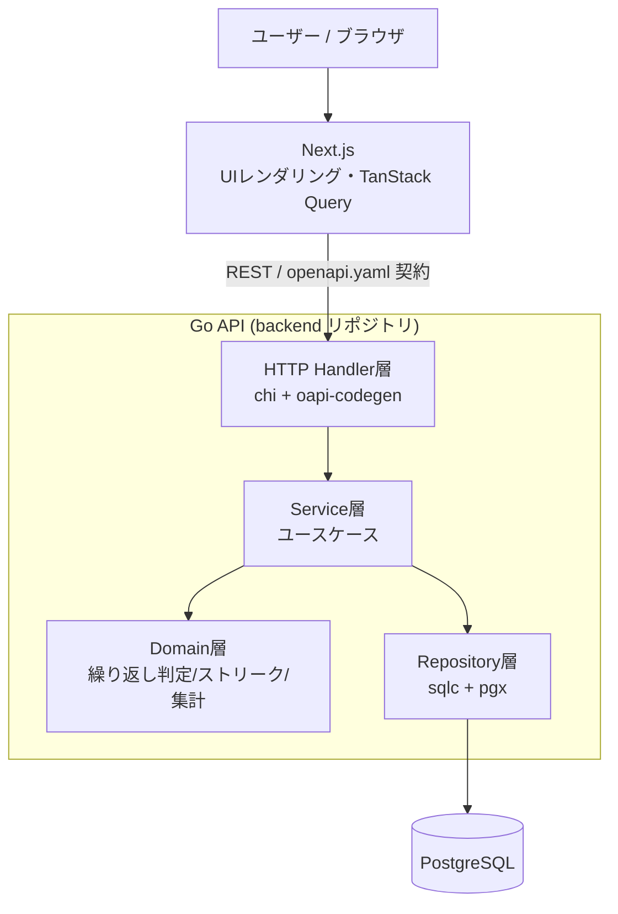
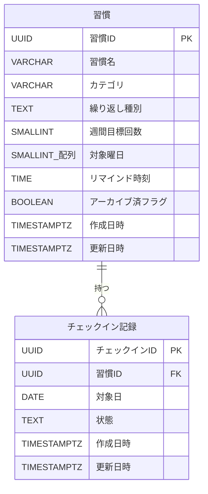
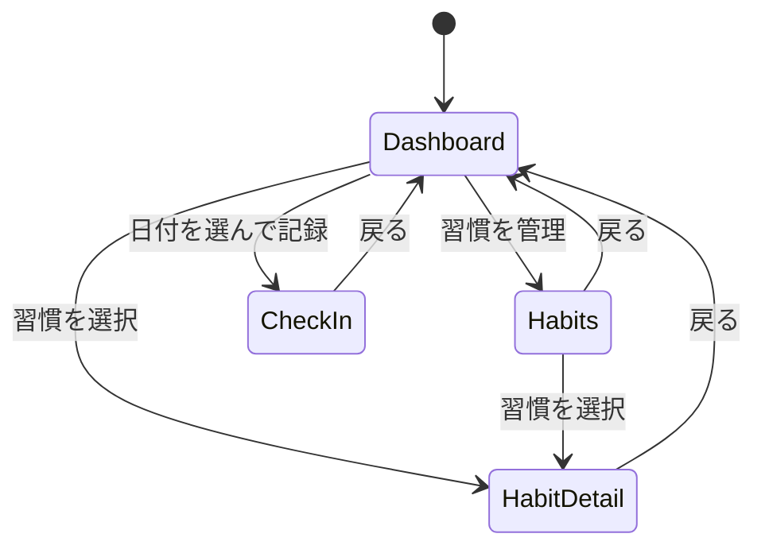
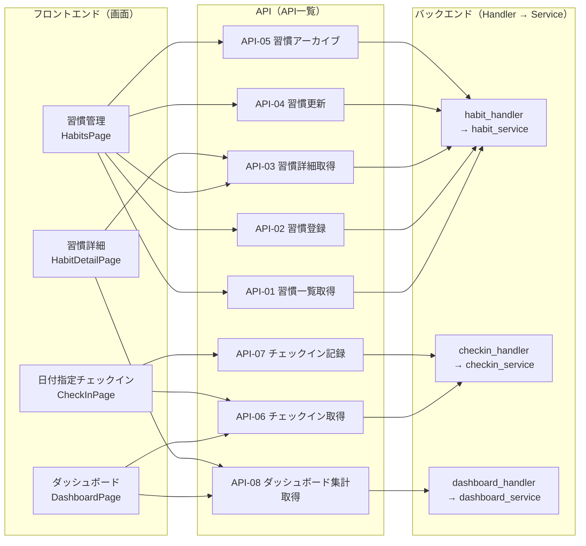

# 機能設計書 (Functional Design Document)

> PRD（`docs/baseline/product-requirements.md`）で定義した要件を、技術的にどう実現するかを定義する
> 基本設計の正本。**プロジェクトの指標としてぶれてはいけない重要点**（システム構成・技術スタック・
> データモデル・中核アルゴリズム・API/画面/ユースケースの一覧・モジュール構成）をここに集約する。
> JSON入出力例・レイヤー別インターフェースなど機能固有の実装詳細は `docs/specs/2_basic-design/`、
> UI表示仕様・エラーハンドリング・テスト戦略などフェーズ横断で参照する実装詳細は
> `docs/specs/_shared/` を参照（いずれも必要な時にだけ参照すればよい内容）。
> 技術選定の詳細な根拠は `docs/baseline/architecture.md` を参照。
> 第一マイルストーン（登録→チェックイン→可視化、単一ユーザー前提）を対象とする。

## システム構成図

3リポジトリ（docs / backend / frontend）構成。ブラウザ（Next.js が配信する SPA 相当の UI）から
Go API（REST）を直接呼び出し、Go API が PostgreSQL を読み書きする。Next.js は BFF にせず、
UI レンダリングに専念する。



**レイヤーの方針**:
- **Domain層は外部依存ゼロ**（DB・HTTP を知らない純粋なロジック）。繰り返し判定・ストリーク計算・
  集計はここに置き、単体テストで網羅する（PRD の主眼＝テスト容易性）。詳細は
  [「アルゴリズム設計（ドメインロジック）」](#アルゴリズム設計ドメインロジック)を参照。
- Service層がユースケースを組み立て、Repository を介して永続化する。
- Handler層は OpenAPI 契約から生成した型で入出力を受け、Service に委譲する。
- レイヤー別の責務・許可/禁止ルールの正本は `docs/baseline/architecture.md`「アーキテクチャパターン」。
  各層のインターフェース（擬似コード）は `docs/specs/2_basic-design/component-design.md`。

## 技術スタック

| 分類 | 技術 | 選定理由 |
|------|------|----------|
| バックエンド言語 | Go | 堅い型・明示的な設計でドメインロジック/テスト設計が映える |
| HTTPルーター | chi | net/http 互換の軽量ルーター |
| API契約 | OpenAPI + oapi-codegen | `openapi.yaml` を正本に Go サーバ型/スタブを生成 |
| DBアクセス | sqlc + pgx | SQL から型安全な Go コードを生成。集計クエリが見える |
| マイグレーション | golang-migrate | up/down SQL をバージョン管理 |
| データベース | PostgreSQL | 日付/期間集計が強く、将来のマルチユーザー化に拡張可能 |
| フロントフレームワーク | Next.js (React + TypeScript) | React ベースの定番。UIレンダリングに専念 |
| データ取得 | TanStack Query | キャッシュ/再取得/楽観更新 |
| スタイル/UI | Tailwind CSS + shadcn/ui | 定番・学習価値が高い |
| API型（フロント） | OpenAPI から TS クライアント型を生成 | 契約不一致を防ぐ |
| テスト | testify / testcontainers-go / Vitest / Playwright | 単体・DB結合・FE単体・E2E結合 |

詳細は `architecture.md` を正本とする。

## データモデル

第一マイルストーンのエンティティは **Habit（習慣）** と **CheckIn（チェックイン記録）** の2つ。
将来の認証追加に備え、`Habit` にユーザー分離を後付けできる余地を残す（第一版では持たない）。

フィールドと物理制約の**正本は後述の「テーブル定義（物理スキーマ）」の表**とする。本節では、表で
表しづらいエンティティの区分値とドメイン上の意味だけを補足する（概念モデルの camelCase 名と
物理カラム snake_case は対応する。例: `recurrenceType` ↔ `recurrence_type`）。

### エンティティと区分値

- エンティティは **Habit（習慣）** と **CheckIn（チェックイン記録）** の2つ。関係は **Habit 1 ―― * CheckIn**。
- コード・API・ドメインロジックで用いる区分値（型名と取りうる値）:
  - `RecurrenceType` = `daily` | `weekly_count` | `specific_days`
  - `CheckInStatus` = `done` | `not_done`

### ドメイン上の制約（物理スキーマで表現しないもの）

物理的な制約（型・NULL・一意・CHECK）はテーブル定義の表を正本とする。以下は DB では担保せず、
ドメイン層で扱う意味・ルール:

- `check_ins.date` は習慣の繰り返しルール上「対象日」であること。**非対象日への記録は原則しない
  （判定は Domain層。DB制約ではない）**。拒否時は **HTTP 422 Unprocessable Entity** を返す
  （構文上は正しいがビジネスルール上処理不可のため）。対象日判定は
  [「アルゴリズム設計（ドメインロジック）」](#アルゴリズム設計ドメインロジック)を参照。
- `not_done`（明示的な未達成）とレコードなし（未記録）は区別しうるが、集計では「対象日かつ done でない」を
  未達成として扱う（詳細は「アルゴリズム設計（ドメインロジック）」の集計アルゴリズム）。
- 習慣の削除は物理削除ではなく `archived=true`（論理削除）で行い、過去のチェックイン記録との整合を保つ。

### ER図

エンティティ・属性は日本語の論理名で示す（物理名との対応はテーブル定義の表を参照）。



### テーブル定義（物理スキーマ）

以下のカラム定義表を**正本**とする。物理DDL（`golang-migrate` の up/down SQL）は本表を基に、
詳細設計／マイグレーション実装のタイミングで生成する（`sqlc` はそのDDLを入力に型安全な Go コードを生成）。
概念モデルの camelCase フィールドは、テーブルでは snake_case カラムに対応する
（例: `recurrenceType` ↔ `recurrence_type`）。

#### habits テーブル（論理名: 習慣）

| カラム（物理名） | 論理名 | 型 | NULL | デフォルト | 説明 |
|---|---|---|:--:|---|---|
| `id` | 習慣ID | UUID | 不可 | `gen_random_uuid()` | 主キー |
| `name` | 習慣名 | VARCHAR(100) | 不可 | — | 1〜100文字 |
| `category` | カテゴリ | VARCHAR(100) | 可 | — | 任意カテゴリ |
| `recurrence_type` | 繰り返し種別 | TEXT | 不可 | — | `daily` / `weekly_count` / `specific_days` |
| `weekly_target_count` | 週間目標回数 | SMALLINT | 可 | — | `weekly_count` 時のみ 1〜7 |
| `target_weekdays` | 対象曜日 | SMALLINT[] | 可 | — | `specific_days` 時のみ。要素は 0(日)〜6(土) |
| `reminder_time` | リマインド時刻 | TIME | 可 | — | `HH:MM` 相当。保持のみ（実配信なし） |
| `archived` | アーカイブ済フラグ | BOOLEAN | 不可 | `FALSE` | 論理削除フラグ |
| `created_at` | 作成日時 | TIMESTAMPTZ | 不可 | `now()` | 作成日時 |
| `updated_at` | 更新日時 | TIMESTAMPTZ | 不可 | `now()` | 更新時に更新 |

**制約・インデックス**

| 名前 | 種別 | 内容 |
|---|---|---|
| （主キー） | PK | `id` |
| `habits_name_len` | CHECK | `name` は 1〜100 文字 |
| `habits_recurrence_type_valid` | CHECK | `recurrence_type` ∈ { `daily`, `weekly_count`, `specific_days` } |
| `habits_recurrence_consistency` | CHECK | 繰り返しルールと付随項目の整合（下表） |

繰り返しルール整合（`habits_recurrence_consistency` の内容）:

| `recurrence_type` | `weekly_target_count` | `target_weekdays` |
|---|---|---|
| `daily` | NULL | NULL |
| `weekly_count` | 1〜7（必須） | NULL |
| `specific_days` | NULL | 1要素以上・各要素 0〜6（必須） |

#### check_ins テーブル（論理名: チェックイン記録）

| カラム（物理名） | 論理名 | 型 | NULL | デフォルト | 説明 |
|---|---|---|:--:|---|---|
| `id` | チェックインID | UUID | 不可 | `gen_random_uuid()` | 主キー |
| `habit_id` | 習慣ID | UUID | 不可 | — | `habits(id)` への外部キー |
| `date` | 対象日 | DATE | 不可 | — | 記録対象の日付（時刻は持たない） |
| `status` | 状態 | TEXT | 不可 | — | `done` / `not_done` |
| `created_at` | 作成日時 | TIMESTAMPTZ | 不可 | `now()` | 作成日時 |
| `updated_at` | 更新日時 | TIMESTAMPTZ | 不可 | `now()` | 更新日時 |

**制約・インデックス**

| 名前 | 種別 | 内容 |
|---|---|---|
| （主キー） | PK | `id` |
| `check_ins_habit_id_fkey` | FK | `habit_id` → `habits(id)`（`ON DELETE CASCADE`） |
| `check_ins_status_valid` | CHECK | `status` ∈ { `done`, `not_done` } |
| `check_ins_habit_date_unique` | UNIQUE | (`habit_id`, `date`)。同一習慣・同一日で重複不可。upsert の競合ターゲット |
| `idx_check_ins_date` | INDEX | (`date`)。日付起点の取得（`listByDate`）用 |

**設計メモ（確定事項）**:
- 日付・時刻は**サーバーローカル時刻基準**で扱う（第一マイルストーンは単一ユーザー・ローカル前提のため
  ユーザーTZは持たない）。
- `gen_random_uuid()` は PostgreSQL 13+ で組み込み（本プロジェクトは 16 以降を想定）。
- `UNIQUE (habit_id, date)` が張る索引を `listByHabitInRange`（習慣×期間）と upsert の競合判定に利用。
  日付起点の取得には別途 `idx_check_ins_date` を用いる。
- `habits` は論理削除（`archived`）を基本とするため物理削除は通常発生しないが、FK は
  `ON DELETE CASCADE` とし、万一の物理削除時も孤児レコードを残さない。
- `updated_at` は**アプリケーション側（Service層のUPDATEクエリ）で明示的に `now()` を設定する**
  （DBトリガーは使わない。sqlc でクエリを明示的に書く方針と一貫させる）。
- `reminder_time` の型は **`TIME`** で確定。当日ダッシュボードの超過ハイライトは、
  **当日の対象習慣のみを対象に、サーバー時刻基準**（`reminder_time` < 現在のサーバー時刻）で判定する
  （過去日は対象外）。

## アルゴリズム設計（ドメインロジック）

**本アプリの中核**であり、テスト設計の主対象。すべて Domain層に純粋関数として実装する
（実装場所は `backend: internal/domain/`）。データ型は「データモデル」を参照。

**日付・時刻はサーバーローカル時刻基準**で扱う（データモデルの「設計メモ（確定事項）」参照）。

### アルゴリズム1: 対象日判定 `isTargetDate(habit, date)`

**目的**: ある日付がその習慣の対象日かを判定する。

**ロジック**:
- `daily`: 常に対象（true）。
- `specific_days`: `date` の曜日が `targetWeekdays` に含まれれば対象。
- `weekly_count`: 「その日が対象か」は曜日では決まらない。**週内のどの日でも達成にカウントできる**
  ルールとして扱い、対象日判定では「その週に属する任意の日は候補日」とみなす。達成/未達成の判定は
  週単位で行う（下記ストリーク・達成率で詳述）。UI 上は当該週の目標未達なら候補として表示する。

> `weekly_count` の「対象日」概念は日単位ではなく週単位。**週の起点は月曜始まり（ISO 8601）で確定**。

### アルゴリズム2: ストリーク算出 `calcStreak(habit, checkIns, today)`

**目的**: 現在ストリークと最長ストリークを求める。**対象外の日は連続を途切れさせない／対象日の
未達成で途切れる**（PRD 受け入れ条件）。

**日単位ルール（daily / specific_days）**:
1. 習慣作成日〜today の各日を走査する。
2. 各日について `isTargetDate` を評価:
   - 非対象日 → 連続に影響しない（スキップ、途切れさせない）。
   - 対象日かつ `done` → 連続カウント +1。
   - 対象日かつ done でない（`not_done` または未記録）→ 連続を 0 にリセット（途切れる）。
     - ただし **today 自体が対象日でまだ未記録の場合は「未達成による途切れ」とはみなさない**
       （その日はこれから記録しうるため、現在ストリーク判定では中立に扱う）。
3. `current` = today から遡って途切れずに続いている対象日達成数。`longest` = 走査中の最大連続数。

**週単位ルール（weekly_count）**:
- 週（月曜始まり）ごとに「その週の done 件数 >= weeklyTargetCount」を達成とみなす。
- 達成した週が連続している数を週ストリークとして数える（対象外＝該当なしの週は生じない前提。
  途切れは「未達成の週」で発生）。今週は進行中のため未達成でも途切れとみなさない。

**エッジケース（テスト対象）**:
- 対象外の日を挟んでも連続とみなす（例: 月水金習慣で火木を挟んで継続）。
- 対象日の未達成で途切れる。
- 遡って過去の記録を修正するとストリークが再計算される。
- today が対象日で未記録のときの中立扱い。

### アルゴリズム3: 達成率 `calcAchievementRate(habit, checkIns, from, to)`

**目的**: 期間内の「対象日に対する完了日の割合」を算出する。

**計算式**:
```
達成率 = (期間内の対象日のうち done の数) / (期間内の対象日の総数)
```
- 分母 0（期間内に対象日なし）のときは「対象なし」として率を表示しない（0% ではない）。
- `weekly_count` は「期間内の対象週数（月曜始まりの週で区切る）」に対する「達成週数」で率を出す。

**例**:
```
入力: 月水金習慣、期間内対象日 12 日、うち done 9 日
出力: 75%
```

### ヒートマップ用データ

- 期間内の各日について `{ date, state }` を返す。`state ∈ { not_target, done, missed, unrecorded }`。
- UI 側で色分けする（色の割り当ては `docs/specs/_shared/cross-cutting.md` の
  UI設計を参照）。

## API一覧

REST / JSON。`openapi.yaml`（正本は backend リポジトリ）を契約の正本とし、**完全なスキーマ・型はそこで確定**する。
本節の一覧は **API名・ID の正本**（他資料からは ID で参照する）。第一マイルストーンは単一ユーザー前提のため
認証はなし（スコープ外）。各APIの入出力詳細・リクエスト/レスポンス例・エラーレスポンスは
`docs/specs/2_basic-design/api-design.md` を参照。

| ID | API名 | メソッド | パス | 概要 |
|---|---|---|---|---|
| API-01 | 習慣一覧取得 | GET | `/habits` | アクティブな習慣の一覧 |
| API-02 | 習慣登録 | POST | `/habits` | 習慣を新規作成 |
| API-03 | 習慣詳細取得 | GET | `/habits/{id}` | 習慣1件の詳細 |
| API-04 | 習慣更新 | PUT | `/habits/{id}` | 習慣を編集 |
| API-05 | 習慣アーカイブ | DELETE | `/habits/{id}` | 習慣を論理削除（`archived=true`） |
| API-06 | チェックイン取得 | GET | `/check-ins?date=YYYY-MM-DD` | 指定日の対象習慣＋記録状態 |
| API-07 | チェックイン記録 | PUT | `/habits/{id}/check-ins/{date}` | 指定日の完了/未完了を記録・修正（upsert） |
| API-08 | ダッシュボード集計取得 | GET | `/dashboard?from=..&to=..` | ストリーク・達成率・ヒートマップの集約 |

API名・ID の採番は本一覧を正本とし、追加時は連番（API-09…）で付与する。

## 画面設計

画面一覧と画面遷移を定義する。**本節の画面一覧を画面命名の正本**とする。UI コンポーネントの責務・
インターフェースは `docs/specs/2_basic-design/component-design.md`、UI 表示仕様
（色・状態表現など）は `docs/specs/_shared/cross-cutting.md` を参照。

### 画面一覧

第一マイルストーン（登録→チェックイン→可視化、単一ユーザー前提）の画面。
ルートはフロントエンド（Next.js）のパスであり、API パス（「API一覧」）とは別物。

| 画面名 | ルート(FE) | 対応コンポーネント | 目的 | 主な要素 | 主なAPI |
|---|---|---|---|---|---|
| ダッシュボード | `/` | `DashboardPage` | 当日の対象習慣とサマリーを一望する | 当日チェックインリスト、リマインド超過ハイライト、ストリーク、達成率、ヒートマップ | `GET /check-ins?date=today`、`GET /dashboard` |
| 習慣管理 | `/habits` | `HabitsPage` | 習慣の一覧・作成・編集・アーカイブ | 習慣一覧、作成/編集フォーム、アーカイブ操作 | `GET /habits`、`POST /habits`、`PUT /habits/{id}`、`DELETE /habits/{id}` |
| 日付指定チェックイン | `/check-ins?date=YYYY-MM-DD` | `CheckInPage` | 過去日を選んで対象習慣を記録する | 日付ピッカー、対象習慣リスト、完了/未完了トグル | `GET /check-ins?date=`、`PUT /habits/{id}/check-ins/{date}` |
| 習慣詳細 | `/habits/{id}` | `HabitDetailPage` | 個別習慣の推移を確認する | 達成率リング、ストリークバッジ、ヒートマップカレンダー | `GET /habits/{id}`、`GET /dashboard` |

### 画面遷移図



> ノード名は画面一覧の対応コンポーネント（`Dashboard`＝`DashboardPage` 等）に対応する。

## ユースケース一覧

主要ユースケースを一覧化する。各ユースケースのシーケンス図（レイヤー横断の詳細な挙動）は
`docs/specs/2_basic-design/usecase.md` を参照。

第一マイルストーン（登録→チェックイン→可視化、単一ユーザー前提）の主要ユースケース。

| ID | ユースケース | アクター | 目的 | 関連画面 |
|---|---|---|---|---|
| UC-01 | 日次チェックイン | ユーザー | 当日の対象習慣を一覧し、完了/未完了を記録する | ダッシュボード、日付指定チェックイン |
| UC-02 | 可視化（ダッシュボード集計） | ユーザー | ストリーク・達成率・ヒートマップを集計して確認する | ダッシュボード、習慣詳細 |

## モジュール構成図（画面 × API × バックエンド）

フロントエンドの画面と backend のモジュールを API で紐づけた俯瞰図。対応データの正本は各節に置く:
画面一覧＝「画面設計」、API一覧＝「API一覧」、各モジュールの責務＝
`docs/specs/2_basic-design/component-design.md` の各層セクション。



**読み方**:
- 画面 → API: 各画面が呼ぶ API（詳細は「画面設計」の「主なAPI」列が正本）。
- API 定義: メソッド・パス・入出力は「API一覧」が正本（ノードは同じ ID）。
- API → backend モジュール: `habit_*`＝習慣CRUD、`checkin_*`＝チェックイン、`dashboard_*`＝集計。
  責務・依存は `component-design.md` の各層、物理配置は
  [リポジトリ構造定義書](repository-structure.md)。

> API を追加・変更したら「API一覧」を更新し、本図も追随させる。
