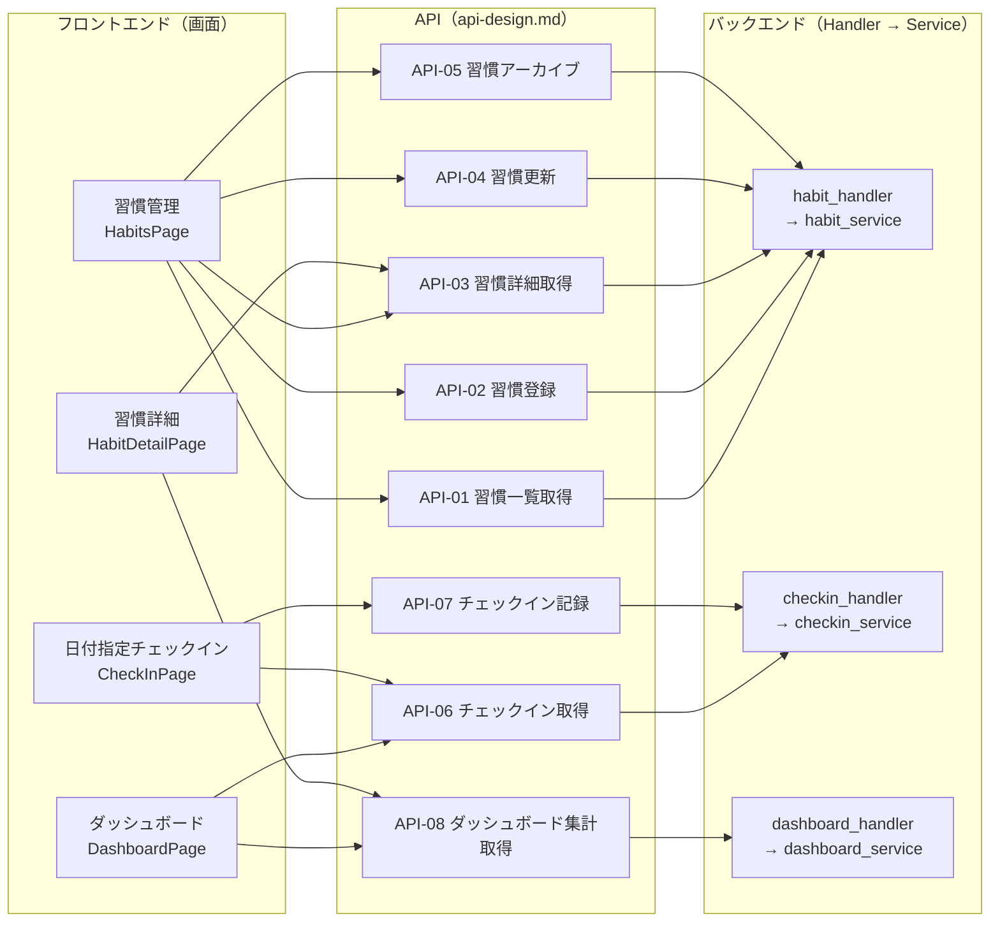

# コンポーネント設計

> 機能設計書の一部。親: [`functional-design.md`](../functional-design.md)。
> レイヤー別（Handler / Service / Domain / Repository / Frontend）の責務・インターフェース・依存を定義し、
> 末尾に**画面 × API × モジュールの構成図**を示す。
> データモデルは [`data-model.md`](./data-model.md)、アルゴリズムは [`domain-logic.md`](./domain-logic.md) を参照。

## Domain層（backend / 外部依存なし・テストの主対象）

**責務**:
- ある日付が習慣の対象日かを判定する（繰り返しルール解釈）。
- チェックイン記録列からストリーク（現在・最長）を算出する。
- 週次・月次の達成率とヒートマップ用データを集計する。

**インターフェース（擬似）**:
```typescript
// 繰り返し判定
function isTargetDate(habit: Habit, date: string): boolean;

// 期間内の対象日一覧
function targetDatesInRange(habit: Habit, from: string, to: string): string[];

// ストリーク算出（対象外の日は連続を途切れさせない／対象日の未達成で途切れる）
function calcStreak(habit: Habit, checkIns: CheckIn[], today: string): {
  current: number;
  longest: number;
};

// 達成率（対象日に対する done の割合）
function calcAchievementRate(habit: Habit, checkIns: CheckIn[], from: string, to: string): number;
```

**依存関係**: なし（Go の標準ライブラリのみ）。ロジックの詳細は [`domain-logic.md`](./domain-logic.md)。

## Repository層（backend）

**責務**: Habit・CheckIn の永続化と取得（sqlc 生成コード + pgx）。

**インターフェース（擬似）**:
```typescript
interface HabitRepository {
  create(h: Habit): Habit;
  update(h: Habit): Habit;
  archive(id: string): void;
  findById(id: string): Habit | null;
  listActive(): Habit[];
}

interface CheckInRepository {
  upsert(c: CheckIn): CheckIn;                       // (habitId,date) で upsert
  listByHabitInRange(habitId: string, from: string, to: string): CheckIn[];
  listByDate(date: string): CheckIn[];
}
```

**依存関係**: PostgreSQL（pgx コネクション）。

## Service層（backend）

**責務**: ユースケースの組み立て。Domain層で判定・計算し、Repository で永続化する。

**主なユースケース**:
```typescript
interface HabitService {
  createHabit(input): Habit;              // バリデーション→保存
  updateHabit(id, input): Habit;
  deleteHabit(id): void;                  // archive
  listHabits(): Habit[];
}

interface CheckInService {
  // 指定日の対象習慣＋現在の記録状態を返す（ダッシュボード/チェックイン画面用）
  getCheckInsForDate(date): { habit: Habit; status: CheckInStatus | null; overdue: boolean }[];
  // 完了/未完了を記録（対象日判定→upsert→関連集計の再計算はGET側で都度算出）
  recordCheckIn(habitId, date, status): CheckIn;
}

interface DashboardService {
  // 習慣ごとのストリーク・達成率・ヒートマップを集約
  getSummary(range): DashboardSummary;
}
```

## Handler層（backend）

**責務**: OpenAPI 契約から生成した型で HTTP 入出力を受け、Service に委譲。バリデーションエラー・
NotFound を HTTP ステータスに変換する。エンドポイント仕様は [`api-design.md`](./api-design.md)。

## フロントエンド（frontend / Next.js）

**責務**: 画面描画とユーザー操作。TanStack Query で Go API を呼び、キャッシュ・楽観更新を行う。
OpenAPI から生成した TS クライアント型を用いる。

**主なコンポーネント**:
- ページコンポーネント（`DashboardPage` / `HabitsPage` / `CheckInPage` / `HabitDetailPage`）。
  各ページの目的・ルート・扱うデータの一覧は [`screen-design.md`](./screen-design.md) の画面一覧を正本とする。
- `HeatmapCalendar`・`StreakBadge`・`AchievementRing` などの表示コンポーネント。

画面一覧・画面遷移は [`screen-design.md`](./screen-design.md)、ユースケースの流れは
[`usecase.md`](./usecase.md)、UI 表示仕様は [`cross-cutting.md`](./cross-cutting.md) を参照。

## モジュール構成図（画面 × API × バックエンド）

フロントエンドの画面と backend のモジュールを API で紐づけた俯瞰図。対応データの正本は各資料に置く:
画面一覧＝[`screen-design.md`](./screen-design.md)、API一覧＝[`api-design.md`](./api-design.md)、
各モジュールの責務＝本ファイル上部の各層セクション。



**読み方**:
- 画面 → API: 各画面が呼ぶ API（詳細は [`screen-design.md`](./screen-design.md) の「主なAPI」列が正本）。
- API 定義: メソッド・パス・入出力は [`api-design.md`](./api-design.md) の API一覧が正本（ノードは同じ ID）。
- API → backend モジュール: `habit_*`＝習慣CRUD、`checkin_*`＝チェックイン、`dashboard_*`＝集計。
  責務・依存は本ファイル上部の各層、物理配置は [リポジトリ構造定義書](../repository-structure.md)。

> API を追加・変更したら [`api-design.md`](./api-design.md) の一覧を更新し、本図も追随させる。
